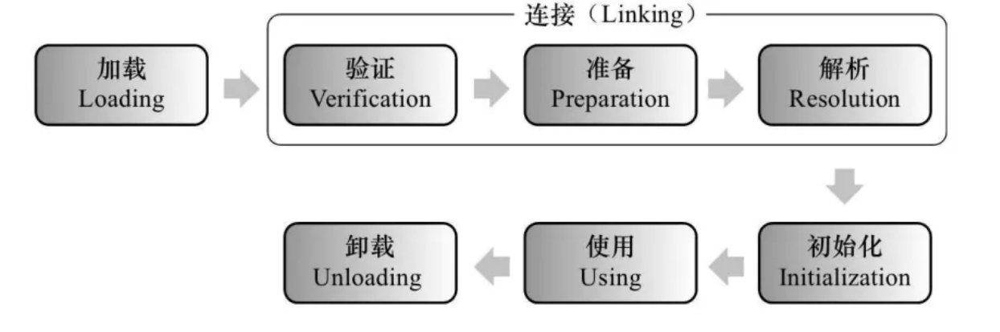

Class初始化过程是什么
类加载的过程
我们可以先简单说下类加载的过程，大致分为：
加载、验证、准备、解析、初始化 几个阶段，使用和卸载都是已经加载完成之后，属于类的生命周期的
两个阶段

类的初始化过程
下面我们就重点分析类的初始化的过程：
1. 类的初始化阶段，是真正开始执行类中定义的java程序代码(字节码)并按程序员的意图去初始化类
变量的过程。更直接地说，初始化阶段就是执行类构造器()方法的过程。 ()方法是由编译器自动收
集类中的所有类变量的赋值动作和静态代码块static{}中的语句合并产生的，其中编译器收集的顺序
是由语句在源文件中出现的顺序所决定 ，重点就是类变量和静态代码块按源文件中定义的顺序决定
执行顺序
2. 关于类初始化的顺序（静态变量、静态初始化块：决于它们在类中出现的先后顺序）>（普通成员
变量、初始化代码块：决于它们在类中出现的先后顺序）>构造器
3. 关于类初始化的详细过程，参见 Java虚拟机规范一书中（有兴趣的同学可以看下英文原版的Java虚
拟机规范：Java® Virtual Machine Specification 8），
详细过程如下：
    1. 每个类都有一个初始化锁LC，线程获取LC，这个操作会导致当前线程一直等待，直到获取到
    LC锁
    2. 如果C正在被其他线程初始化，当前线程会释放LC锁进入阻塞状态，并等待C初始化完成。此
    时当前线程需要重试这一过程。执行初始化过程时，线程的中断状态不受影响
    3. 如果C正在被本线程初始化，即递归初始化，释放LC并且正常返回
    4. 如果C已经被初始化完成，释放LC并且正常返回
    5. 如果C处于错误状态，表明不可能再完成初始化，释放LC并抛出异常NoClassDefFoundError
    异常
    6. 否则，将C标记为正在被本线程初始化，释放LC；然后，初始化那些final且为基础类型的类成
    员变量
    7. 如果C是类而不是接口，且C的父类Super Class（SC）和各个接口SI_n（按照implements子
    句中的顺序来）还没有初始化，那么就在SC上面递归地进行完整的初始化过程，如果有必
    要，需要先验证和准备SC ；如果SC或SIn初始化过程中抛出异常，则获取LC，将C标记为错误
    状态，并通知所有正在等待的线程，然后释放LC，然后再抛出同样的异常。
    8. 从C的classloader处获取assertion断言机制是否被打开
    9. 接下来，按照文本顺序执行类变量初始化和静态代码块，或接口的字段初始化，把它们当作是
    一个个单独的代码块。
    10. 如果执行正常，那就获取LC，标记C对象为已初始化，并通知所有正在等待的线程，然后释放
    LC，正常退出整个过程
    11. 否则，如果抛出了异常E那么会中断退出。若E不是Error，则以E为参数创建新的异常
    ExceptionInInitializerError作为E。如果因为OutOfMemoryError导致无法创建
    ExceptionInInitializerError，则将OutOfMemoryError作为E。
    12. 获取LC，将C标记为错误状态，通知所有等待的线程，释放LC，并抛出异常E
    可以看到 JLS确实规定了父类先初始化、static块和类变量赋值按照文本顺序来解析