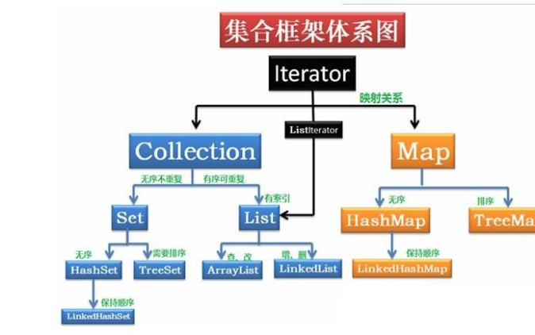
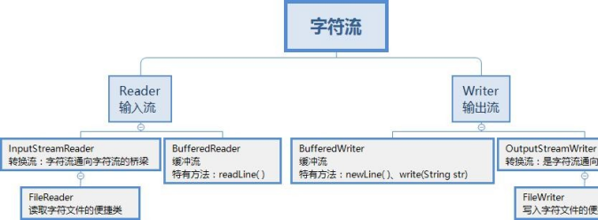

# java基础

1、你是怎样理解 OOP 面向对象	难度系数：⭐

面向对象是利于语言对现实事物进行抽象。面向对象具有以下特征：  
继承：继承是从已有类得到继承信息创建新类的过程  
封装：封装是把数据和操作数据的方法绑定起来，对数据的访问只能通过已定义的接口  
多态性：多态性是指允许不同子类型的对象对同一消息作出不同的响应

  
2、重载与重写区别	难度系数：⭐

重载发生在本类，重写发生在父类与子类之间

重载的方法名必须相同，重写的方法名相同且返回值类型必须相同

重载的参数列表不同，重写的参数列表必须相同

重写的访问权限不能比父类中被重写的方法的访问权限更低

构造方法不能被重写

  
3、接口与抽象类的区别	难度系数：⭐

抽象类要被子类继承，接口要被类实现

接口可多继承接口，但类只能单继承

抽象类可以有构造器、接口不能有构造器

抽象类：除了不能实例化抽象类之外，它和普通 Java 类没有任何区别

抽象类：抽象方法可以有 public、protected 和 default 这些修饰符、接口：只能是 public  
抽象类：可以有成员变量；接口：只能声明常量

  
4、深拷贝与浅拷贝的理解	难度系数：⭐

深拷贝和浅拷贝就是指对象的拷贝，一个对象中存在两种类型的属性，一种是基本数据类型，一种是实例对象的引用。  
浅拷贝是指，只会拷贝基本数据类型的值，以及实例对象的引用地址，并不会复制一份引用地址所指向的对象，也就是浅拷贝出来的对象，内部的类属性指向的是同一个对象  
深拷贝是指，既会拷贝基本数据类型的值，也会针对实例对象的引用地址所指向的对象进行复制，深拷贝出来的对象，内部的类执行指向的不是同一个对象

5、sleep 和 wait 区别	难度系数：⭐

sleep 方法

属于 Thread 类中的方法

释放 cpu 给其它线程 不释放锁资源

sleep(1000) 等待超过 1s 被唤醒

wait 方法

属于 Object 类中的方法

释放 cpu 给其它线程，同时释放锁资源

wait(1000) 等待超过 1s 被唤醒

wait() 一直等待需要通过 notify 或者 notifyAll 进行唤醒

wait 方法必须配合 synchronized 一起使用，不然在运行时就会抛出  
IllegalMonitorStateException 异常

#### 锁释放时机代码演示
#### 锁释放时机代码演示

public static void main(String[] args) { Object o = new Object();

Thread thread = new Thread(() -> { synchronized (o) {

System.out.println("新线程获取锁时间：" + LocalDateTime.now() + " 新线程名称：" + Thread.currentThread().getName());

try {

//wait 释放cpu 同时释放锁o.wait(2000);

//sleep 释放cpu 不释放锁

//Thread.sleep(2000);

System.out.println("新线程获取释放锁锁时间：" + LocalDateTime.now()

+ " 新线程名称：" + Thread.currentThread().getName());

} catch (InterruptedException e) { throw new RuntimeException(e);

}

}

});

thread.start();

try {

Thread.sleep(100);

} catch (InterruptedException e) { throw new RuntimeException(e);

}

System.out.println("主线程获取锁时间：" + LocalDateTime.now() + " 主线程名称：" + Thread.currentThread().getName());

synchronized (o){

System.out.println("主线程获取释放锁锁时间：" + LocalDateTime.now() + "主线程名称：" + Thread.currentThread().getName());

   }

}

6、什么是自动拆装箱 int 和 Integer 有什么区别	难度系数：⭐

基本数据类型，如 int,float,double,boolean,char,byte,不具备对象的特征，不能调用方法。  
装箱：将基本类型转换成包装类对象

拆箱：将包装类对象转换成基本类型的值

java 为什么要引入自动装箱和拆箱的功能？主要是用于 java 集合中，List list=new ArrayList();  
list 集合如果要放整数的话，只能放对象，不能放基本类型，因此需要将整数自动装箱成对象。  
实现原理：javac 编译器的语法糖，底层是通过 Integer.valueOf()和 Integer.intValue()  
方法实现。  
区别：  
Integer 是 int 的包装类，int 则是 java 的一种基本数据类型

Integer 变量必须实例化后才能使用，而 int 变量不需要

Integer 实际是对象的引用，当 new 一个 Integer 时，实际上是生成一个指针指向此对象；而 int 则是直接存储数据值  
Integer 的默认值是 null，int 的默认值是 0

7、==和 equals 区别	难度系数：⭐

	==  
如果比较的是基本数据类型，那么比较的是变量的值

如果比较的是引用数据类型，那么比较的是地址值（两个对象是否指向同一块内存）  
equals  
如果没重写 equals 方法比较的是两个对象的地址值

如果重写了 equals 方法后我们往往比较的是对象中的属性的内容

equals 方法是从 Object 类中继承的，默认的实现就是使用==

  
8、String 能被继承吗 为什么用 final 修饰	难度系数：⭐

不能被继承，因为 String 类有 final 修饰符，而 final 修饰的类是不能被继承的。

String 类是最常用的类之一，为了效率，禁止被继承和重写。

为了安全。String 类中有 native 关键字修饰的调用系统级别的本地方法，调用了操作系统的 API，如果方法可以重写，可能被植入恶意代码，破坏程序。Java 的安全性也体现在这里。

  
9、String buffer 和 String builder 区别	难度系数：⭐

StringBuffer 与 StringBuilder 中的方法和功能完全是等价的，

只是 StringBuffer 中的方法大都采用了 synchronized 关键字进行修饰，因此是线程安全的，而 StringBuilder 没有这个修饰，可以被认为是线程不安全的。  
在单线程程序下，StringBuilder 效率更快，因为它不需要加锁，不具备多线程安全而 StringBuffer 则每次都需要判断锁，效率相对更低

  
10、final、finally、finalize	难度系数：⭐

final：修饰符（关键字）有三种用法：修饰类、变量和方法。修饰类时，意味着它不能再派生出新的子类，即不能被继承，因此它和 abstract 是反义词。修饰变

量时，该变量使用中不被改变，必须在声明时给定初值，在引用中只能读取不可修改，即为常量。修饰方法时，也同样只能使用，不能在子类中被重写。  
finally：通常放在 try…catch 的后面构造最终执行代码块，这就意味着程序无论正常执行还是发生异常，这里的代码只要 JVM 不关闭都能执行，可以将释放外部资  
源的代码写在 finally 块中。  
finalize：Object 类中定义的方法，Java 中允许使用 finalize() 方法在垃圾收集器将对象从内存中清除出去之前做必要的清理工作。这个方法是由垃圾收集器在销毁对象时调用的，通过重写 finalize() 方法可以整理系统资源或者执行其他清理工作。

  
11、Object 中有哪些方法	难度系数：⭐

protected Object clone()--->创建并返回此对象的一个副本。

boolean equals(Object obj)--->指示某个其他对象是否与此对象“相等

protected void finalize()--->当垃圾回收器确定不存在对该对象的更多引用时，由对象的垃圾回收器调用此方法。  
Class<? extendsObject> getClass()--->返回一个对象的运行时类。

int hashCode()--->返回该对象的哈希码值。

void notify()--->唤醒在此对象监视器上等待的单个线程。

void notifyAll()--->唤醒在此对象监视器上等待的所有线程。

String toString()--->返回该对象的字符串表示。

void wait()--->导致当前的线程等待，直到其他线程调用此对象的 notify() 方法或 notifyAll() 方法。  
void wait(long timeout)--->导致当前的线程等待，直到其他线程调用此对象的 notify() 方法或 notifyAll()方法，或者超过指定的时间量。  
void wait(long timeout, int nanos)--->导致当前的线程等待，直到其他线程调用此对象的 notify()方法或 notifyAll（）方法，或者已经过了指定的时间 量。此方法类似于一个参数的 wait 方法，但它允许更好地控制在放弃之前等待通知的时间量。 以纳秒为单位的实时数量由下式给出:  
1000000*timeout+nanos

12、说一下集合体系	难度系数：⭐

13、ArrarList 和 LinkedList 区别	难度系数：⭐

ArrayList 是实现了基于动态数组的数据结构，LinkedList 基于链表的数据结构。

对于随机访问 get 和 set，ArrayList 效率优于 LinkedList，因为 LinkedList 要移动指针。  
对于新增和删除操作 add 和 remove，LinkedList 比较占优势，因为 ArrayList 要移动数据。 这一点要看实际情况的。若只对单条数据插入或删除，ArrayList 的速度反而优于 LinkedList。但若是批量随机的插入删除数据，LinkedList 的速度大大优于 ArrayList. 因为 ArrayList 每插入一条数据，要移动插入点及之后的所有数据。

14、HashMap 底层是 数组+链表+红黑树，为什么要用这几类结构	难度系数：⭐⭐

数组 Node<K,V>[] table ,哈希表，根据对象的 key 的 hash 值进行在数组里面是哪个节点  
链表的作用是解决 hash 冲突，将 hash 值取模之后的对象存在一个链表放在  
hash 值对应的槽位

红黑树 JDK8 使用红黑树来替代超过 8 个节点的链表，主要是查询性能的提升， 从原来的 O(n)到 O(logn),  
通过 hash 碰撞，让 HashMap 不断产生碰撞，那么相同的 key 的位置的链表就会不断增长，当对这个 Hashmap 的相应位置进行查询的时候，就会循环遍历这个超级大的链表，性能就会下降，所以改用红黑树

  
15、HashMap 和 HashTable 区别	难度系数：⭐

线程安全性不同  
HashMap 是线程不安全的，HashTable 是线程安全的，其中的方法是Synchronized，在多线程并发的情况下，可以直接使用 HashTable，但是使用HashMap 时必须自己增加同步处理。  
是否提供 contains 方法  
HashMap 只有 containsValue 和 containsKey 方法；HashTable 有 contains、containsKey 和 containsValue 三个方法，其中 contains 和 containsValue 方法功能相同。  
key 和 value 是否允许 null 值  
Hashtable 中，key 和 value 都不允许出现 null 值。HashMap 中，null 可以作为键，这样的键只有一个；可以有一个或多个键所对应的值为 null。  
数组初始化和扩容机制  
HashTable 在不指定容量的情况下的默认容量为 11，而 HashMap 为 16， Hashtable 不要求底层数组的容量一定要为 2 的整数次幂，而 HashMap 则要求一定为 2 的整数次幂。

Hashtable 扩容时，将容量变为原来的 2 倍加 1，而 HashMap 扩容时，将容量变为原来的 2 倍。

  
16、线程的创建方式	难度系数：⭐

继承 Thread 类创建线程

实现 Runnable 接口创建线程

使用 Callable 和 Future 创建线程 有返回值

使用线程池创建线程

//线程池  
ThreadPoolExecutor threadPoolExecutor = new ThreadPoolExecutor(1, 1, 2, TimeUnit.SECONDS, new ArrayBlockingQueue<>(10));  
threadPoolExecutor.execute(thread); threadPoolExecutor.shutdown(); Thread.sleep(100); System.out.println("#####################");

//使用并发包Executors  
ExecutorService executorService = Executors.newFixedThreadPool(5); executorService.execute(thread);  
executorService.shutdown();  
}  
}

class ThreadClass extends Thread{ [@Override ](/Override )   
public void run() {  
System.out.println("我是继承thread 形式：" + Thread.currentThread().getName());  
}  
}

class RunnableClass implements Runnable{ [@Override ](/Override )   
public void run(){  
System.out.println("我是实现runnable 接口：" + Thread.currentThread().getName());  
}  
}

class CallableClass implements Callable { [@Override ](/Override )

 

17、线程的状态转换有什么（生命周期）	难度系数：⭐

新建状态(New) ：线程对象被创建后，就进入了新建状态。例如，Thread thread  
= new Thread()。

就绪状态(Runnable): 也被称为“可执行状态”。线程对象被创建后，其它线程调用了该对象的 start()方法，从而来启动该线程。例如，thread.start()。处于就绪状态的线程，随时可能被 CPU 调度执行。  
运行状态(Running)：线程获取 CPU 权限进行执行。需要注意的是，线程只能从就绪状态进入到运行状态。  
阻塞状态(Blocked)：阻塞状态是线程因为某种原因放弃 CPU 使用权，暂时停止运行。直到线程进入就绪状态，才有机会转到运行状态。阻塞的情况分三种：  
等待阻塞 -- 通过调用线程的 wait()方法，让线程等待某工作的完成。

同步阻塞 -- 线程在获取 synchronized 同步锁失败(因为锁被其它线程所占用)，它会进入同步阻塞状态。  
其他阻塞 -- 通过调用线程的 sleep()或 join()或发出了 I/O 请求时，线程会进入到阻塞状态。当 sleep()状态超时、join(）等待线程终止或者超时、或者 I/O 处理完毕时，线程重新转入就绪状态。  
死亡状态(Dead)：线程执行完了或者因异常退出了 run()方法，该线程结束生命周期。

  
18、Java 中有几种类型的流	难度系数：⭐

19、请写出你最常见的 5 个 RuntimeException	难度系数：⭐

java.lang.NullPointerException  
空指针异常；出现原因：调用了未经初始化的对象或者是不存在的对象。

java.lang.ClassNotFoundException  
指定的类找不到；出现原因：类的名称和路径加载错误；通常都是程序试图通过字符串来加载某个类时可能引发异常。  
java.lang.NumberFormatException  
字符串转换为数字异常；出现原因：字符型数据中包含非数字型字符。

java.lang.IndexOutOfBoundsException  
数组角标越界异常，常见于操作数组对象时发生。

java.lang.IllegalArgumentException  
方法传递参数错误。

java.lang.ClassCastException  
数据类型转换异常。

20、谈谈你对反射的理解	难度系数：⭐

反射机制  
所谓的反射机制就是 java 语言在运行时拥有一项自观的能力。通过这种能力可以彻底了解自身的情况为下一步的动作做准备。  
Java 的反射机制的实现要借助于 4 个类：class，Constructor，Field，Method;其中 class 代表的是类对象，Constructor－类的构造器对象，Field－类的属性对象， Method－类的方法对象。通过这四个对象我们可以粗略的看到一个类的各个组成部分。  
Java 反射的作用  
在 Java 运行时环境中，对于任意一个类，可以知道这个类有哪些属性和方法。对于任意一个对象，可以调用它的任意一个方法。这种动态获取类的信息以及动态调用对象的方法的功能来自于 Java 语言的反射（Reflection）机制。  
Java 反射机制提供功能  
在运行时判断任意一个对象所属的类。在运行时构造任意一个类的对象。  
在运行时判断任意一个类所具有的成员变量和方法。在运行时调用任意一个对象的方法

  
21、什么是 java 序列化，如何实现 java 序列化	难度系数：⭐

序列化是一种用来处理对象流的机制，所谓对象流也就是将对象的内容进行流化。可以对流化后的对象进行读写操作，也可将流化后的对象传输于网络之间。序列化是为了解决在对对象流进行读写操作时所引发的问题。  
序列化的实现 ： 将需要被序列化的类实现 Serializable 接 口 ， 该接口没有 需要 实 现 的 方 法 ， implements Serializable 只是为了标注该对象是可被序列化的， 然后使用一个输出流(如：FileOutputStream)来构造一个 ObjectOutputStream(对象流) 对象，接着，使用 ObjectOutputStream 对象的 writeObject(Object obj)方法就可以将参数为 obj 的对象写出(即保存其状态)，要恢复的话则用输入流。

22、Http 常见的状态码	难度系数：⭐

1.200 OK//客户端请求成功

2.301	Permanently Moved （永久移除)，请求的 URL 已移走。Response 中应该包含一个 Location URL, 说明资源现在所处的位置

| 3. 302 | Temporarily Moved 临时重定向 |
| :--- | :--- |
| 4. 400 | Bad Request //客户端请求有语法错误，不能被服务器所理解 |
| 5. 401 | Unauthorized //请求未经授权，这个状态代码必须和WWW- |
| henticate 报头域一起使用  6. 403	Forbidden //服务器收到请求，但是拒绝提供服务 | |
| 7. 404 | Not Found //请求资源不存在，eg：输入了错误的URL |
| 8. 500 | Internal Server Error //服务器发生不可预期的错误 |
| 9. 503 | Server Unavailable //服务器当前不能处理客户端的请求，一段时间后可能恢复正常 |

  
23、GET 和 POST 的区别	难度系数：⭐

GET 请求的数据会附在 URL 之后（就是把数据放置在 HTTP 协议头中），以? 分割 URL 和传输数据，参数之间以&相连，如： login.action?name=zhagnsan&password=123456。POST 把提交的数据则放置在是HTTP 包的包体中。  
GET 方式提交的数据最多只能是 1024 字节，理论上 POST 没有限制，可传较大量的数据。其实这样说是错误的，不准确的：“GET 方式提交的数据最多只能是1024 字节"，因为 GET 是通过 URL 提交数据，那么 GET 可提交的数据量就跟 URL 的长度有直接关系了。而实际上，URL 不存在参数上限的问题，HTTP 协议规范没有对URL 长度进行限制。这个限制是特定的浏览器及服务器对它的限制。IE 对 URL 长度的限制是 2083 字节(2K+35)。对于其他浏览器，如 Netscape、FireFox 等，理论上没有长度限制，其限制取决于操作系统的支持。  
POST 的安全性要比 GET 的安全性高。注意：这里所说的安全性和上面 GET 提到的“安全”不是同个概念。上面“安全”的含义仅仅是不作数据修改，而这里安全的含义是真正的 Security 的含义，比如：通过 GET 提交数据，用户名和密码将明文出现在URL 上，因为(1)登录页面有可能被浏览器缓存，(2)其他人查看浏览器的历史纪录，那么别人就可以拿到你的账号和密码了，除此之外，使用 GET 提交数据还可能会造成  
Cross-site request forgery 攻击。

Get 是向服务器发索取数据的一种请求，而 Post 是向服务器提交数据的一种请求，在 FORM（表单）中，Method  
默认为"GET"，实质上，GET 和 POST 只是发送机制不同，并不是一个取一个发！

  
24、Cookie 和 Session 的区别	难度系数：⭐

Cookie 是 web 服务器发送给浏览器的一块信息，浏览器会在本地一个文件中给每个 web 服务器存储 cookie。以后浏览器再给特定的 web 服务器发送请求时，同时会发送所有为该服务器存储的 cookie  
Session 是存储在 web 服务器端的一块信息。session 对象存储特定用户会话所需的属性及配置信息。当用户在应用程序的 Web 页之间跳转时，存储在 Session 对象中的变量将不会丢失，而是在整个用户会话中一直存在下去  
Cookie 和 session 的不同点

无论客户端做怎样的设置，session 都能够正常工作。当客户端禁用 cookie 时将无法使用 cookie  
在存储的数据量方面：session 能够存储任意的 java 对象，cookie 只能存储  
String 类型的对象

> 更新: 2024-04-30 16:34:05  
> 原文: <https://www.yuque.com/zhichangzhishiku/edrbqg/oce4l53awn12s6kn>