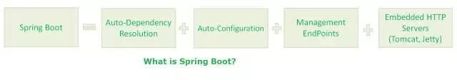

# 14、谈谈怎么理解 SpringBoot 框架

Spring Boot 是Spring 开源组织下的子项目，是Spring 组件一站式解决方案，主要是简化了使用Spring 的难度，简省了繁重的配置，提供了各种启动器，开发者能快速上手。

  

**Spring Boot 的优点**

● 独立运行

Spring Boot 而且内嵌了各种servlet 容器，Tomcat、Jetty 等，现在不再需要打成war 包部署到容器中，Spring Boot 只要打成一个可执行的jar 包就能独立运行，所有的依赖包都在一个jar 包内。

● 简化配置

spring-boot-starter-web 启动器自动依赖其他组件，简少了maven 的配置。除此之外，还提供了各种启动器，开发者能快速上手。

● 自动配置

Spring Boot 能根据当前类路径下的类、jar 包来自动配置bean，如添加一个spring- boot-starter-web 启动器就能拥有web 的功能，无需其他配置。

● 无代码生成和XML 配置

Spring Boot 配置过程中无代码生成，也无需XML 配置文件就能完成所有配置工作， 这一切都是借助于条件注解完成的，这也是Spring4.x 的核心功能之一。

● 应用监控

Spring Boot 提供一系列端点可以监控服务及应用，做健康检测。

**Spring**** ****Boot**** ****缺点：**

Spring Boot 虽然上手很容易，但如果你不了解其核心技术及流程，所以一旦遇到问题就很棘手，而且现在的解决方案也不是很多，需要一个完善的过程。

> 更新: 2024-05-01 16:03:10  
> 原文: <https://www.yuque.com/zhichangzhishiku/edrbqg/fp9gsa6rnzl36lvo>