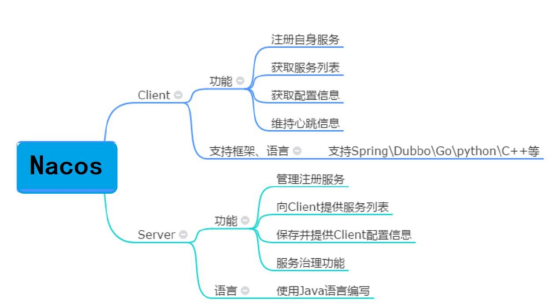
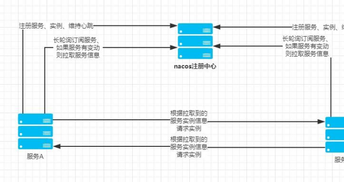

# 20、Nacos 作用以及注册中心的原理

Nacos 英文全称Dynamic Naming and Configuration Service，Na 为

naming/nameServer 即注册中心,co 为configuration 即注册中心，service 是指该注册

/配置中心都是以服务为核心。

Nacos 注册中心分为server 与client，server 采用Java 编写，为client 提供注册发现服务与配置服务。而client 可以用多语言实现，client 与微服务嵌套在一起，nacos 提供sdk 和openApi，如果没有sdk 也可以根据openApi 手动写服务注册与发现和配置拉取的逻辑。

**服务注册原理**

服务注册方法：以Java nacos client v1.0.1 为例子，服务注册的策略的是每5 秒向nacos server 发送一次心跳，心跳带上了服务名，服务ip，服务端口等信息。同时nacos server 也会向client 主动发起健康检查，支持tcp/http 检查。如果15 秒内无心跳且健康检查失败则认为实例不健康，如果30 秒内健康检查失败则剔除实例。

更新: 2024-05-01 16:06:35  
