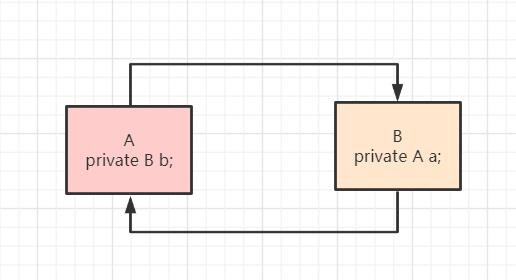

# 6、Spring 循环依赖问题

## **常见问法**

请解释一下spring 中的三级缓存

三级缓存分别是什么?三个Map 有什么异同?

什么是循环依赖?请你谈谈?看过spring 源码吗?

如何检测是否存在循环依赖?实际开发中见过循环依赖的异常吗? 多例的情况下,循环依赖问题为什么无法解决?

什么是循环依赖?

**两种注入方式对循环依赖的影响****?********官方解释**

[https://docs.spring.io/spring-](https://docs.spring.io/spring-framework/docs/current/reference/html/core.html) <u>framework/docs/current/reference/html/core.html#beans-dependency-resolution</u>

相关概念

实例化:堆内存中申请空间

| | |
| --- | --- |
| | |

初始化:对象属性赋值

三级缓存

| 名称 | | 对象名 | 含义 |
| :--- | --- | :--- | :--- |
| 一级 | 缓存 | singletonObjects | 存放已经经历了完整生命周期的 Bean 对象 |
| 二级 | 缓存 | earlySingletonObjects | 存放早期暴露出来的Bean 对象，Bean 的生命周期未结束（属性还未填充完) |
| 三级 | 缓存 | singletonFactories | 存放可以生成Bean 的工厂 |

四个关键方法

package org.springframework.beans.factory.support;

public class DefaultSingletonBeanRegistry extends SimpleAliasRegistry implements SingletonBeanRegistry {

/**

单例对象的缓存:bean 名称—bean 实例，即:所谓的单例池。表示已经经历了完整生命周期的Bean 对象

**第一级缓存**

*/

private final Map<String, Object> singletonObjects = new ConcurrentHashMap<>(256);

/**

早期的单例对象的高速缓存: bean 名称—bean 实例。

表示Bean 的生命周期还没走完（Bean 的属性还未填充）就把这个Bean 存入该缓存中也就是实例化但未初始化的bean 放入该缓存里

**第二级缓存**

*/

private final Map<String, Object> earlySingletonObjects = new HashMap<>(16);

/**

单例工厂的高速缓存:bean 名称—ObjectFactory 表示存放生成bean 的工厂

**第三级缓存**

*/

private final Map<String, ObjectFactory<?>> singletonFactories = new HashMap<>(16);

}

debug 源代码过程

需要22 个断点(可选)

1，A 创建过程中需要B，于是A 将自己放到三级缓里面，去实例化B

2，B 实例化的时候发现需要A，于是B 先查一级缓存，没有，再查二级缓存，还是没有，再查三级缓存，找到了A 然后把三级缓存里面的这个A 放到二级缓存里面，并删除三级缓存里面的A

3，B 顺利初始化完毕，将自己放到一级缓存里面(此时B 里面的A 依然是创建中状态)

然后回来接着创建A，此时B 已经创建结束，直接从一级缓存里面拿到B，然后完成创建，并将A 自己放到一级缓存里面。

**总结**

1，Spring 创建bean 主要分为两个步骤，创建原始bean 对象，接着去填充对象属性和初始化。

2，每次创建bean 之前，我们都会从缓存中查下有没有该bean，因为是单例，只能有一个。

3，当创建A 的原始对象后，并把它放到三级缓存中，接下来就该填充对象属性了，这时候发现依赖了B，接着就又去创建B，同样的流程，创建完B 填充属性时又发现它依赖了A 又是同样的流程，不同的是：这时候可以在三级缓存中查到刚放进去的原始对象A。

所以不需要继续创建，用它注入B，完成B 的创建既然B 创建好了，所以A 就可以完成填充属性的步骤了，接着执行剩下的逻辑，闭环完成

Spring 解决循环依赖依靠的是Bean 的"中间态"这个概念，而这个中间态指的是已经实例化但还没初始化的状态—>半成品。实例化的过程又是通过构造器创建的，如果A 还没创建好出来怎么可能提前曝光，所以构造器的循环依赖无法解决

其他衍生问题

问题1:为什么构造器注入属性无法解决循环依赖问题?

由于spring 中的bean 的创建过程为先实例化再初始化(在进行对象实例化的过程中不必赋值)将实例化好的对象暴露出去,供其他对象调用,然而使用构造器注入,必须要使用构造器完成对象的初始化的操作,就会陷入死循环的状态

问题2:一级缓存能不能解决循环依赖问题? 不能

在三个级别的缓存中存储的对象是有区别的一级缓存为完全实例化且初始化的对象二级缓存实例化但未初始化对象如果只有一级缓存,如果是并发操作下,就有可能取到实例化但未初始化的对象,就会出现问题

问题3:二级缓存能不能解决循环依赖问题?

理论上二级缓存可以解决循环依赖问题,但是需要注意,为什么需要在三级缓存中存储匿名内部类(ObjectFactory),原因在于需要创建代理对象eg:现有A 类,需要生成代理对象A 是否需要进行实例化(需要) 在三级缓存中存放的是生成具体对象的一个匿名内部类,该类可能是代理类也可能是普通的对象,而使用三级缓存可以保证无论是否需要是代理对象,都可以保证使用的是同一个对象,而不会出现,一会儿使用普通bean 一会儿使用代理类

> 更新: 2024-05-03 22:58:49  
