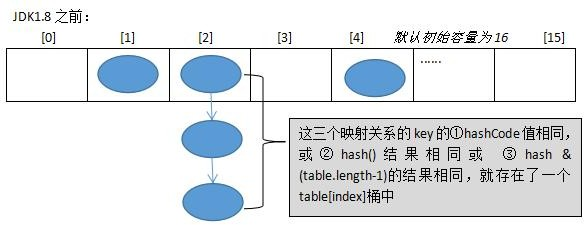
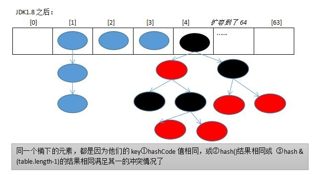
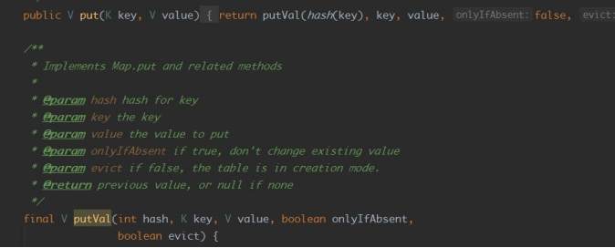
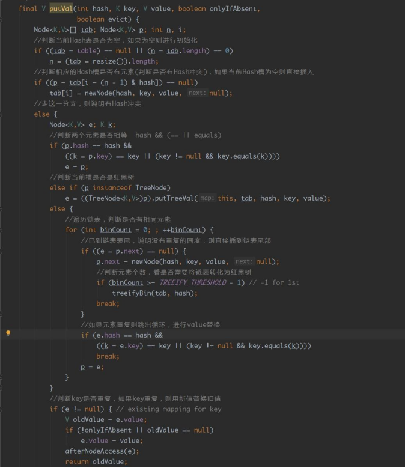
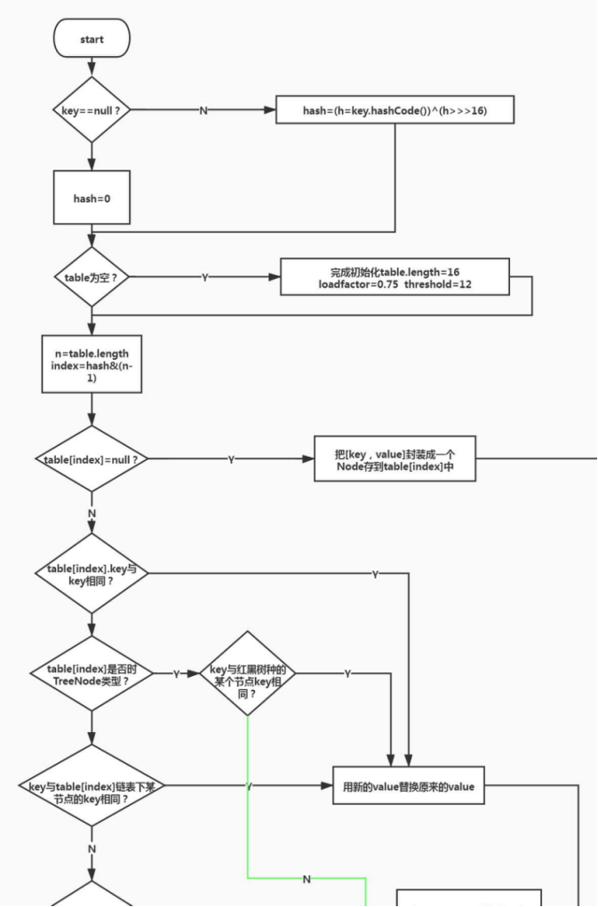

#  1、HashMap底层源码

 HashMap 的底层结构在 jdk1.7 中由数组+链表实现，在 jdk1.8 中由数组+链表+红黑 树实现，以数组+链表的结构为例。

 JDK1.8之前 Put方法： 

JDK1.8之后 Put方法：

** HashMap基于哈希表的 Map接口实现，是以 key-value存储形式存在，即主要用来 存放键值对。**

HashMap 的实现不是同步的，这意味着它不是线程安全的。它的 key、 value 都可以为 null。此外，HashMap 中的映射不是有序的。

JDK1.8 之前 HashMap 由 数组+链表 组成的，数组是 HashMap 的主体，链表则是主要为 了解决哈希冲突(两个对象调用的 hashCode 方法计算的哈希码值一致导致计算的数组索引 值相同)而存在的（“拉链法”解决冲突）.JDK1.8 以后在解决哈希冲突时有了较大的变化， 当链表长度大于阈值（或者红黑树的边界值，默认为 8）并且当前数组的长度大于 64 时，此时此索引位置上的所有数据改为使用红黑树存储。

 **补充：**将链表转换成红黑树前会判断，即使阈值大于 8，但是数组长度小于 64，此时 并不会将链表变为红黑树。而是选择进行数组扩容。

 这样做的目的是因为数组比较小，尽量避开红黑树结构，这种情况下变为红黑树结构，反 而会降低效率，因为红黑树需要进行左旋，右旋，变色这些操作来保持平衡 。同时数组长 度小于 64 时，搜索时间相对要快些。所以综上所述为了提高性能和减少搜索时间，底层 在阈值大于 8 并且数组长度大于 64 时，链表才转换为红黑树。具体可以参考 treeifyBin 方法。 

当然虽然增了红黑树作为底层数据结构，结构变得复杂了，但是阈值大于 8 并且数组 长度大于 64 时，链表转换为红黑树时，效率也变的更高效。

 注意：可以结合百度 hashmap源码解析进行更深入的了解。 https://blog.csdn.net/v123411739/article/details/78996181  

> 更新: 2024-04-30 16:47:16  
> [原文](https://www.yuque.com/zhichangzhishiku/edrbqg/xhy94v5aaku8zf0r>