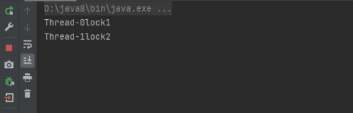
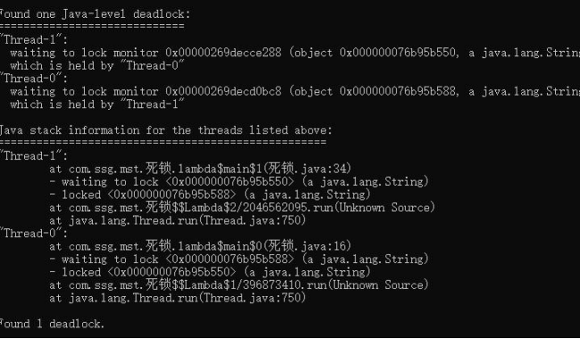

# 22、如何查看 java 死锁

```java
####演示死锁
package com.ssg.mst; public class 死锁 {
    private static final String lock1 = "lock1"; private static final String lock2 = "lock2"; public static void main(String[] args) {
        Thread thread1 = new Thread(() -> { while (true) {
            synchronized (lock1) { try {
                System.out.println(Thread.currentThread().getName() + lock1); Thread.sleep(1000);
                synchronized (lock2){ System.out.println(Thread.currentThread().getName() +

                                                         lock2);


                                    }
            } catch (InterruptedException e) { throw new RuntimeException(e);

                                             }
                                 }
        }
                                          });

        Thread thread2 = new Thread(() -> { while (true) {
            synchronized (lock2) { try {
                System.out.println(Thread.currentThread().getName() + lock2); Thread.sleep(1000);
                synchronized (lock1){ System.out.println(Thread.currentThread().getName() + lock1);
                                    }
            } catch (InterruptedException e) { throw new RuntimeException(e);
                                             }
                                 }
        }})

        thread1.start(); thread2.start();
    }
}

```

1. 程序运行，进程没有停止。



2. 通过jps 查看java 进程，找到没有停止的进程


3. 通过jstack 9060 查看进程具体执行信息




> 更新: 2024-04-30 18:42:20  
> 原文: <https://www.yuque.com/zhichangzhishiku/edrbqg/acy9h7rdxspu1eb0>