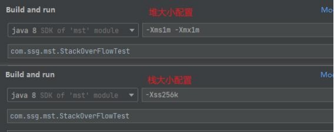
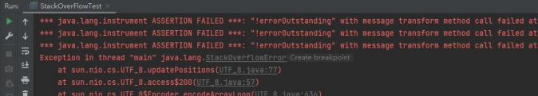
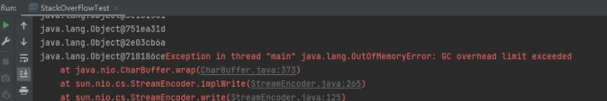

# 5、什么情况下会产生 StackOverflowError（栈溢出）和OutOfMemoryError（堆溢出）怎么排查

(1) 引发StackOverFlowError 的常见原因有以下几种

● 无限递归循环调用（最常见）

● 执行了大量方法，导致线程栈空间耗尽

● 方法内声明了海量的局部变量

● native 代码有栈上分配的逻辑，并且要求的内存还不小，比

如java.net.SocketInputStream.read0 会在栈上要求分配一个64KB 的缓存（64 位

Linux）。

(2) 引发OutOfMemoryError 的常见原因有以下几种

● 内存中加载的数据量过于庞大，如一次从数据库取出过多数据

● 集合类中有对对象的引用，使用完后未清空，使得JVM 不能回收

● 代码中存在死循环或循环产生过多重复的对象实体

● 启动参数内存值设定的过小

l 排查：可以通过jvisualvm 进行内存快照分析

参考[https://www.cnblogs.com/boboooo/p/13164071.html](https://www.cnblogs.com/boboooo/p/13164071.html)

栈溢出、堆溢出案例演示

``public class StackOverFlowTest { private static int count = 1;

                public static void main(String[] args) {

//模拟栈溢出

//getDieCircle();

                               //模拟堆溢出getOutOfMem();

}

public static void getDieCircle(){ System.out.println(count++); getDieCircle();

}

public static void getOutOfMem(){ while (true) {

                Object o = new Object(); System.out.println(o);

          }

    }

}

> 更新: 2024-04-30 16:58:17  
> [原文](https://www.yuque.com/zhichangzhishiku/edrbqg/ddo91gadttgg0kgw>