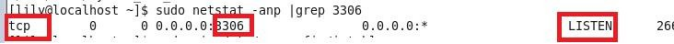
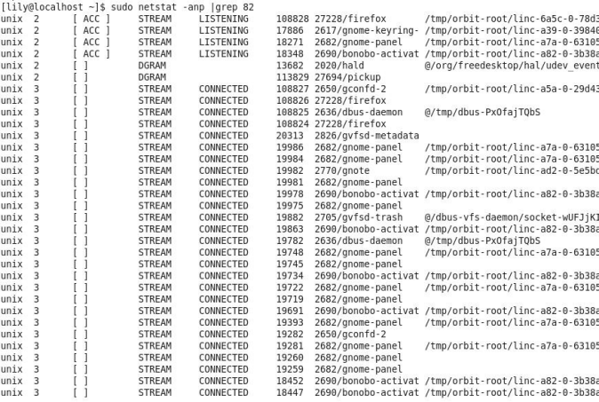

# 4、Linux 中如何查看某个端口是否被占用

>netstat -anp | grep 端口号

图中主要看监控状态为LISTEN 表示已经被占用，最后一列显示被服务mysqld 占用，查看具体端口号，只要有如图这一行就表示被占用了

查看82 端口的使用情况，如图

>netstat -anp |grep 82

可以看出并没有LISTEN 那一行，所以就表示没有被占用。此处注意，图中显示的LISTENING 并不表示端口被占用，不要和LISTEN 混淆哦，查看具体端口时候，必须要看到tcp，端口号，LISTEN 那一行，才表示端口被占用了

  

> 更新: 2024-05-01 16:41:32  
> [原文](https://www.yuque.com/zhichangzhishiku/edrbqg/gvm5sef5zkzlm01m>