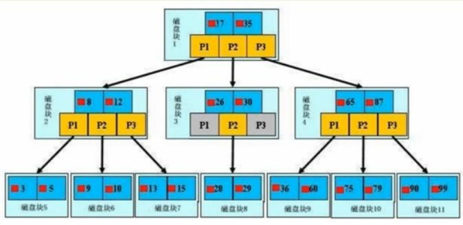
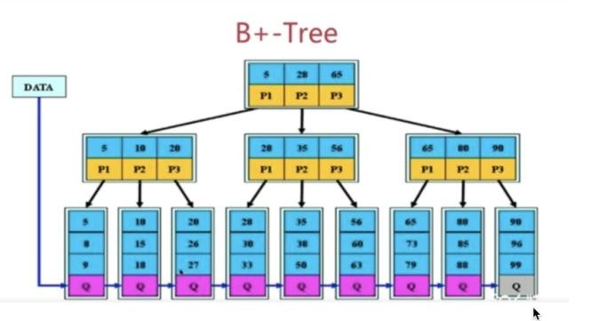

# 7、B+tre 与 B-tre 区别

**原理:**分批次的将磁盘块加载进内存中进行检索,若查到数据,则直接返回,若查不到,则释放内存,并重新加载同等数据量的索引进内存,重新遍历

**结构****: **数据向下的指针指向数据的指针**特点****:**

1，节点排序

2 .一个节点了可以存多个元索，多个元索也排序了

**结构****: **数据向下的指针**特点****:**

1. 拥有B 树的特点

2. 叶子节点之间有指针

3. 非叶子节点上的元素在叶子节点上都冗余了，也就是叶子节点中存储了所有的元素，并且排好顺序

从结构上看,B+Tree 相较于B-Tree 而言缺少了指向数据的指针也就红色小方块;

Mysq|索引使用的是B+树，因为索引是用来加快查询的，而B+树通过对数据进行排序所以是可以提高查询速度的，然后通过一个节点中可以存储多个元素，从而可以使得B+树的高度不会太高，在Mysql 中一个Innodb 页就是一个B+树节点，一个Innodb 页默认16kb，所以一般情况下一颗两层的B+树可以存2000 万行左右的数据，然后通过利用B+树叶子节点存储了所有数据并且进行了排序，并且叶子节点之间有指针，可以很好的支持全表扫描，范围查找等SQL 语句

文章推荐：[https://www.jianshu.com/p/b544d2e10726](https://www.jianshu.com/p/b544d2e10726)

> 更新: 2024-05-01 16:18:53  
