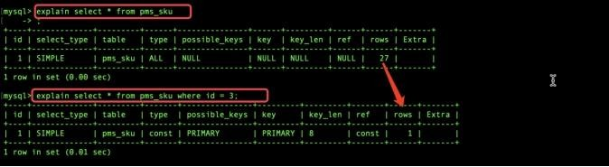

# 8、以 MySQL 为例 Linux 下如何排查问题

**类似提问方式: 如果线上环境出现问题比如网站卡顿重则瘫痪如何是好?**

--->linux--->mysql/redis/nacos/sentinel/sluth--->可以从以上提到的技术点中选择一个自己熟悉单技术点进行分析

**以****mysql**** ****为例**

1,架构层面是否使用主从

2,表结构层面是否满足常规的表设计规范(大量冗余字段会导致查询会变得很复杂)

3,sql 语句层面(⭐)

前提:由于慢查询日志记录默认是关闭的,所以开启数据库mysql 的慢查询记录的功能从慢查询日志中去获取哪些sql 语句时慢查询默认10S ,从中获取到sql 语句进行分析

explain分析一条sql

Id:执行顺序如果单表的话,无参考价值如果是关联查询,会据此判断主表从表

Select_type:simple Table:表

Type: ALL 未创建索引、const、常量ref 其他索引、eq_ref 主键索引、

Possible_keys

Key 实际是到到索引到字段

Key_len 索引字段数据结构所使用长度与是否有默认值null 以及对应字段到数据类型有关，有一个理论值有一个实际使用值也即key_len 的值

Rows 检索的行数与查询返回的行数无关

Extra 常见的值：usingfilesort 使用磁盘排序算法进行排序，事关排序分组的字段是否使用索引的核心参考值

  

还可能这样去提问：sql 语句中哪些位置适合建索引/索引建立在哪个位置Select id,name,age from user where id=1 and name=”xxx” order by age 总结: 查询字段查询条件(最常用) 排序/分组字段

补充:如何判断是数据库的问题?可以借助于top 命令

> 更新: 2024-05-01 16:20:02  
> 原文: <https://www.yuque.com/zhichangzhishiku/edrbqg/aoq2sv97vnbg2i2x>