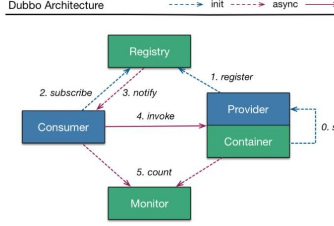

# 10、Dubbo 执行流程是什么样的？各个组件作用

它的架构主要有五个角色/核心组件，分为是 Container（容器）、Provider（服务的提供方）、Registry（注册中心）、Consumer（服务的消费方）、Monitor（监控中  
心）。

容器主要负责启动、加载、运行服务提供者；

同时服务提供者在启动时，向注册中心注册自己提供的服务； 消费者向注册中心订阅自己的服务；  
注册中心返回服务提供者列表给消费者，如果有变更，注册中心将基于长连接推送变更数据给消费者；

对于服务消费者，从提供者地址列表中，基于软负载均衡算法，选一台提供者进行调用，如果调用失败，再选另外一台调用；  
服务消费者和提供者，在内存中累计调用次数和调用时间，定时每分钟发送一次统计数据到监控中心；  
注册中心：  
1.注册中心只负责地址的注册和查找，相当于我们的目录服务，只有在容器启动时，服务提供者和调用者与注册中心交互，整个过程，注册中心不参与数据传输，不转发请求，压力较小 （“两不一小”）；  
2. 注册中心宕机问题：（Dubbo 挂了怎么办？） 注册中心会部署集群，  
如果集群中的任意一台宕机之后，将自动切换到另外一台，不会影响已运行的提供者和消费者；  
如果集群中所有注册中心全部宕机之后，服务提供者和服务消费者仍能通过本地缓存通讯；注册中心仍能通过缓存提供服务列表查询，但不能注册新服务；  
监控中心：  
1.监控中心负责统计各服务调用次数、调用时间等，统计先在内存汇总后每分钟一次发送到监控中心服务器，并以报表展示  
2.监控中心宕机不影响使用，只是丢失部分的采样数据；

3.dubbo-admin 可以通过监控中心的可视化界面，进行禁止服务和截止消费者  
（大量恶意访问的 ip）；

> 更新: 2024-05-01 16:35:41  
