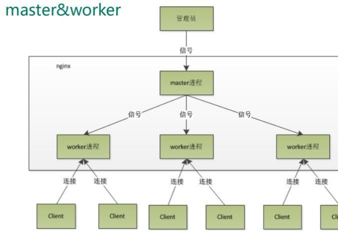
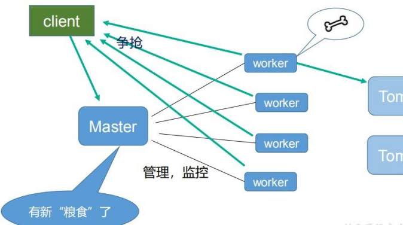

# 13、Nginx 原理

Nginx 内部进程模型：

1. 在nginx 启动后，会有一个master 进程和多个worker 进程，master 进程主要用来管理worker 进程，包括：接受信号，将信号分发给worker 进程，监听worker 进程工作状态，当worker 进程退出时(非正常)，启动新的worker 进程。基本的网络事件会交给worker 进程处理。多个worker 进程之间是对等的，他们同等竞争来自客户端的请求，各进程互相之间是独立的。一个请求，只可能在一个worker 进程中处理， 一个worker 进程，不可能处理其它进程的请求。worker 进程的个数是可以设置的， 一般我们会设置与机器cpu 核数一致，这里面的原因与nginx 的进程模型以及事件处理模型是分不开的。

2. 当master 接收到重新加载的信号会怎么处理(./nginx -s reload)?，master 会重新加载配置文件，然后启动新的进程，使用的新的worker 进程来接受请求，并告诉老的

  

worker 进程他们可以退休了，老的worker 进程将不会接受新的，老的worker 进程处理完手中正在处理的请求就会退出。

3. worker 进程是如何处理用户的请求呢？首先master 会根据配置文件生成一个监听相应端口的socket，然后再faster 出多个worker 进程，这样每个worker 就可以接受从socket 过来的消息（其实这个时候应该是每一个worker 都有一个socket，只是这些socket 监听的地址是一样的）。当一个连接过来的时候，每一个worker 都能接收到通知，但是只有一个worker 能和这个连接建立关系，其他的worker 都会连接失败，这就是所谓的惊群现在，为了解决这个问题，nginx 提供一个共享锁accept_mutex，有了这个共享锁后，就会只有一个worker 去接收这个连接。当一个worker 进程在accept 这个连接之后，就开始读取请求，解析请求，处理请求，产生数据后，再返回给客户端，最后才断开连接，这样一个完整的请求就是这样的了。

**master-workers**** ****的机制的好处**

首先，对于每个worker 进程来说，独立的进程，不需要加锁，所以省掉了锁带来的开销，同时在编程以及问题查找时，也会方便很多。

其次，采用独立的进程，可以让互相之间不会影响，一个进程退出后，其它进程还在工作，服务不会中断，master 进程则很快启动新的worker 进程。

  

当然，worker 进程的异常退出，肯定是程序有bug 了，异常退出，会导致当前

worker 上的所有请求失败，不过不会影响到所有请求，所以降低了风险。**需要设置多少个****worker**

Nginx 同redis 类似都采用了io 多路复用机制，每个worker 都是一个独立的进程，

但每个进程里只有一个主线程，通过异步非阻塞的方式来处理请求，即使是千上万个请求也不在话下。每个worker 的线程可以把一个cpu 的性能发挥到极致。

所以worker 数和服务器的cpu 数相等是最为适宜的。设少了会浪费cpu，设多了会造成cpu 频繁切换上下文带来的损耗。

**#****设置****worker**** ****数量**

worker_processes 4

#work 绑定cpu(4 work 绑定4cpu)。worker_cpu_affinity 0001 0010 0100 1000 #work 绑定cpu (4 work 绑定8cpu 中的4 个) 。

worker_cpu_affinity 00000001 00000010 00000100 00001000 00010000 00100000

01000000 10000000

**#****连接数****worker_connections**** ****1024**

这个值是表示每个worker 进程所能建立连接的最大值，所以，一个nginx 能建立的 最大连接数，应该是worker_connections * worker_processes。当然，这里说的是最大连接数，对于HTTP 请求本地资源来说，能够支持的最大并发数量是worker_connections * worker_processes，如果是支持http1.1 的浏览器每次访问要占两个连接，所以普通的静态访问最大并发数是：worker_connections * worker_processes /2，而如果是HTTP 作为反向代理来说，最大并发数量应该是worker_connections * worker_processes/4。

> 更新: 2024-05-01 16:37:38  
> [原文](https://www.yuque.com/zhichangzhishiku/edrbqg/usc7kulz1nla08ul>