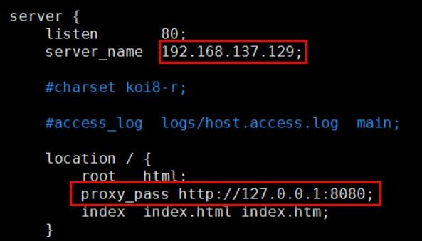
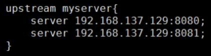
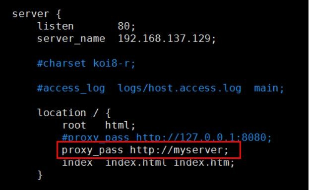
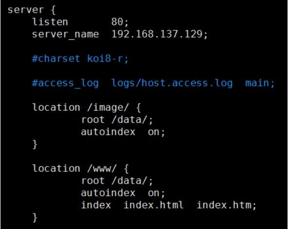

# 14、Nginx 作用以及常见配置

**作用：**反向代理、负载均衡、动静分离（静态资源服务器，可以进行图片等资源管理）

**具体配置实现：**** ****反向代理：**

在nginx.conf 配置文件中增加如下配置

**负载均衡：**** ****常见策略**

**权重：**weight 代表权,重默认为1,权重越高被分配的客户端越多

指定轮询几率，weight 和访问比率成正比，用于后端服务器性能不均的情况。例如：

upstream server_pool{

server 192.168.5.21 weight=1;

server 192.168.5.22 weight=2;

server 192.168.5.23 weight=3;

}

**ip_hash****：**每个请求按访问ip 的hash 结果分配，这样每个访客固定访问一个后端服务器，可以解决session 的问题。例如：

upstream server_pool{

  

ip_hash;

server 192.168.5.21:80;

server 192.168.5.22:80;

}

**fair****（第三方）：**按后端服务器的响应时间来分配请求，响应时间短的优先分配。

upstream server_pool{ server 192.168.5.21:80;

server 192.168.5.22:80;

fair;

}

**轮询****（默认）**

**静态资源****（动静分离）：**

  

****

> 更新: 2024-05-01 16:39:35  
> [原文](https://www.yuque.com/zhichangzhishiku/edrbqg/cgp2xhkb8ng8g9b4>