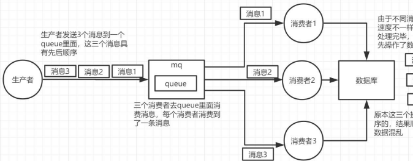
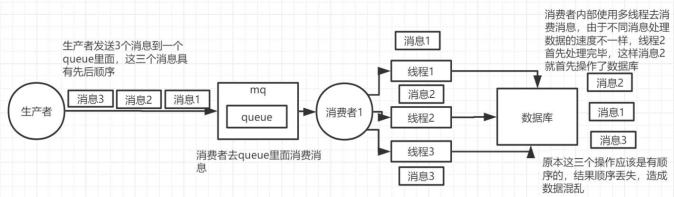
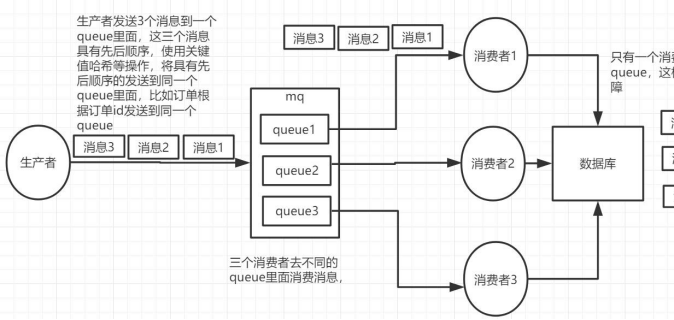
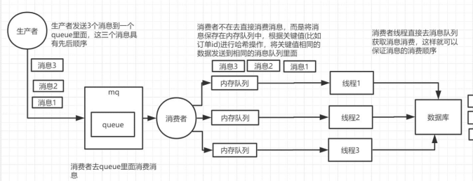

# 2、RabbitMQ 如何保证消息的顺序性

消息队列中的若干消息如果是对同一个数据进行操作，这些操作具有前后的关系，必须要按前后的顺序执行，否则就会造成数据异常。举例：

比如通过mysql binlog 进行两个数据库的数据同步，由于对数据库的数据操作是具有顺序性的，如果操作顺序搞反，就会造成不可估量的错误。比如数据库对一条数据依次进行了插入->更新->删除操作，这个顺序必须是这样，如果在同步过程中，消息的顺序变成了删除->插入->更新，那么原本应该被删除的数据，就没有被删除，造成数据的不一致问题。

举例场景：

RabbitMQ：①一个queue，有多个consumer 去消费，这样就会造成顺序的错误， consumer 从MQ 里面读取数据是有序的，但是每个consumer 的执行时间是不固定的，无法保证先读到消息的consumer 一定先完成操作，这样就会出现消息并没有按照顺序执行，造成数据顺序错误。

②一个queue 对应一个consumer，但是consumer 里面进行了多线程消费，这样也会造成消息消费顺序错误。

解决方案：

①拆分多个queue，每个queue 一个consumer，就是多一些queue 而已，确实是麻烦点；这样也会造成吞吐量下降，可以在消费者内部采用多线程的方式取消费。

一个queue 对应一个consumer

②或者就一个queue 但是对应一个consumer，然后这个consumer 内部用内存队列做排队，然后分发给底层不同的worker 来处理

一个queue 对应一个consumer，采用多线程

> 更新: 2024-05-01 16:31:15  
> 原文: <https://www.yuque.com/zhichangzhishiku/edrbqg/ytzkb5kca4qexgyq>