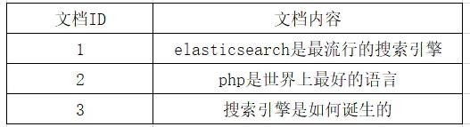
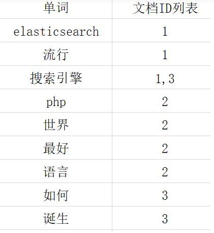

# 9、Elasticsearch 中的倒排索引是什么

**正排索引：**

在说倒排索引之前我们先说说什么是正排索引。正排索引也称为"前向索引"，它是创建倒排索引的基础。

这种组织方法在建立索引的时候结构比较简单，建立比较方便且易于维护;因为索引是基于文档建立的，若是有新的文档加入，直接为该文档建立一个新的索引块，挂接在原来索引文件的后面。若是有文档删除，则直接找到该文档号文档对应的索引信息， 将其直接删除。

他适合根据文档ID 来查询对应的内容。但是在查询一个keyword 在哪些文档里包含的时候需对所有的文档进行扫描以确保没有遗漏，这样就使得检索时间大大延长，检索效率低下。

比如有几个文档及里面的内容，他正排索引构建的结果如下图：

 

**优点：**工作原理非常的简单。

**缺点：**检索效率太低，只能在一起简单的场景下使用。

**倒排索引：**

根据字面意思可以知道他和正序索引是反的。在搜索引擎中每个文件都对应一个文件ID，文件内容被表示为一系列关键词的集合（文档要除去一些无用的词，比如’的’这些，剩下的词就是关键词，每个关键词都有自己的ID）。例如“文档1”经过分词，提取了3 个关键词，每个关键词都会记录它所在在文档中的出现频率及出现位置。

那么上面的文档及内容构建的倒排索引结果会如下图（注：这个图里没有记录展示该词在出现在哪个文档的具体位置）：

**如何来查询呢？**

比如我们要查询‘搜索引擎’这个关键词在哪些文档中出现过。首先我们通过倒排索引可以查询到该关键词出现的文档位置是在1 和3 中;然后再通过正排索引查询到文档1

和3 的内容并返回结果。

  

> 更新: 2024-05-01 16:34:36  
> 原文: <https://www.yuque.com/zhichangzhishiku/edrbqg/xcn0cwo2ab38wv8g>