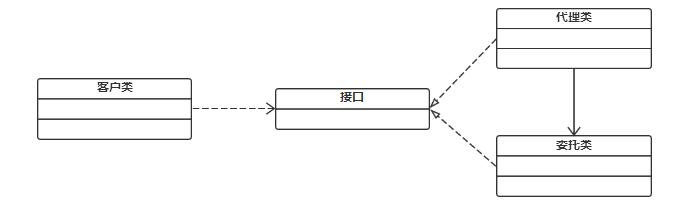

# 4、代理模式（Proxy）

#### **4.1 什么是代理模式？**
****

代理模式给某一个对象提供一个代理对象，并由代理对象控制对原对象的引用。通俗的来讲代理模式就是我们生活中常见的中介。

举个例子来说明：假如说我现在想买一辆二手车，虽然我可以自己去找车源，做质量检测等一系列的车辆过户流程，但是这确实太浪费我得时间和精力了。我只是想买一辆车而已为什么我还要额外做这么多事呢？于是我就通过中介公司来买车，他们来给我找车源，帮我办理车辆过户流程，我只是负责选择自己喜欢的车，然后付钱就可以了。用图表示如下：

#### **4.1**** ****为什么要用代理模式？**
****

**中介隔离作用：**

在某些情况下，一个客户类不想或者不能直接引用一个委托对象，而代理类对象可以在客户类和委托对象之间起到中介的作用，其特征是代理类和委托类实现相同的接 口。

**开闭原则，增加功能：**

代理类除了是客户类和委托类的中介之外，我们还可以通过给代理类增加额外的功能来扩展委托类的功能，这样做我们只需要修改代理类而不需要再修改委托类，符合代码设计的开闭原则。代理类主要负责为委托类预处理消息、过滤消息、把消息转发给委托类，以及事后对返回结果的处理等。代理类本身并不真正实现服务，而是同过调

用委托类的相关方法，来提供特定的服务。真正的业务功能还是由委托类来实现，但是可以在业务功能执行的前后加入一些公共的服务。例如我们想给项目加入缓存、日志这些功能，我们就可以使用代理类来完成，而没必要修改已经封装好的委托类。

#### **4.2**** ****有哪几种代理模式？**
****

我们有多种不同的方式来实现代理。

如果按照代理创建的时期来进行分类的话，可以分为两种：静态代理、动态代理。

● 静态代理是由程序员创建或特定工具自动生成源代码，再对其编译。在程序员运行之前，代理类.class 文件就已经被创建了。

● 动态代理是在程序运行时通过反射机制动态创建的。

#### **4.3**** ****静态代理（****Static**** ****Proxy****）**
****

#### **4.1**** ****简述动态代理的原理，****常用的动态代理的实现方式**
****

动态代理的原理: 使用一个代理将对象包装起来，然后用该代理对象取代原始对象。任何对原始对象的调用都要通过代理。

代理对象决定是否以及何时将方法调用转到原始对象上动态代理的方式

基于接口实现动态代理：JDK 动态代理

基于继承实现动态代理：Cglib、Javassist 动态代理

> 更新: 2024-05-01 16:56:29  
> [原文](https://www.yuque.com/zhichangzhishiku/edrbqg/rc4m1gg851auqlkl>