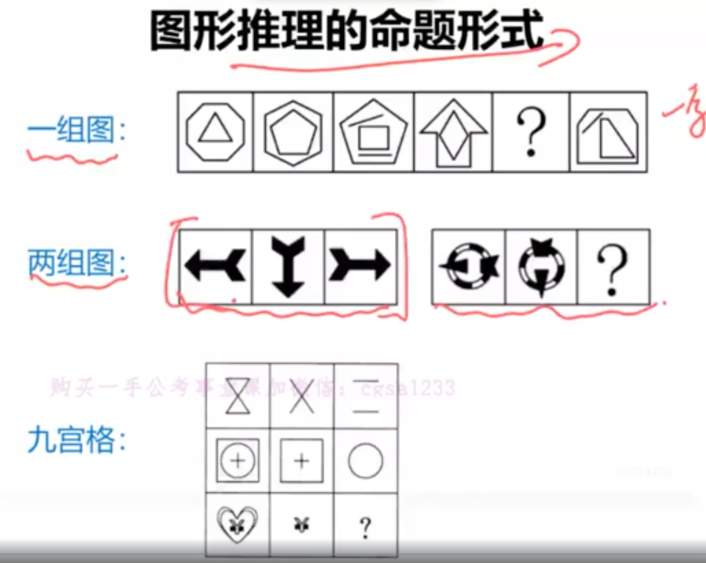
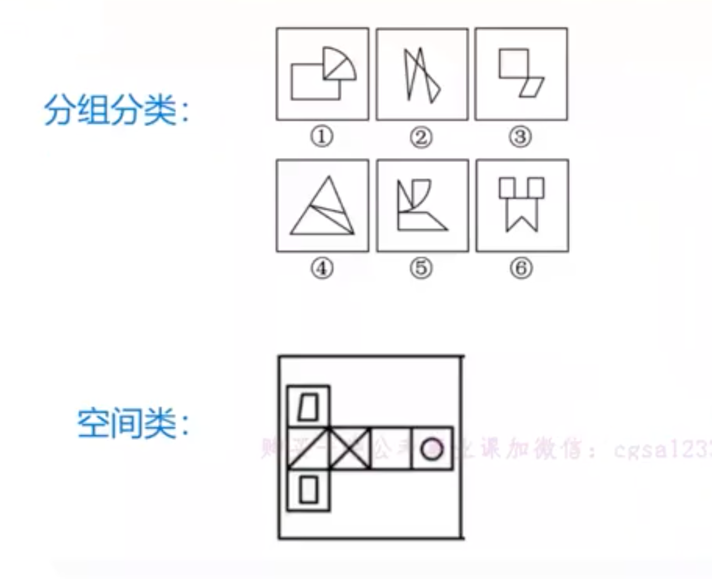
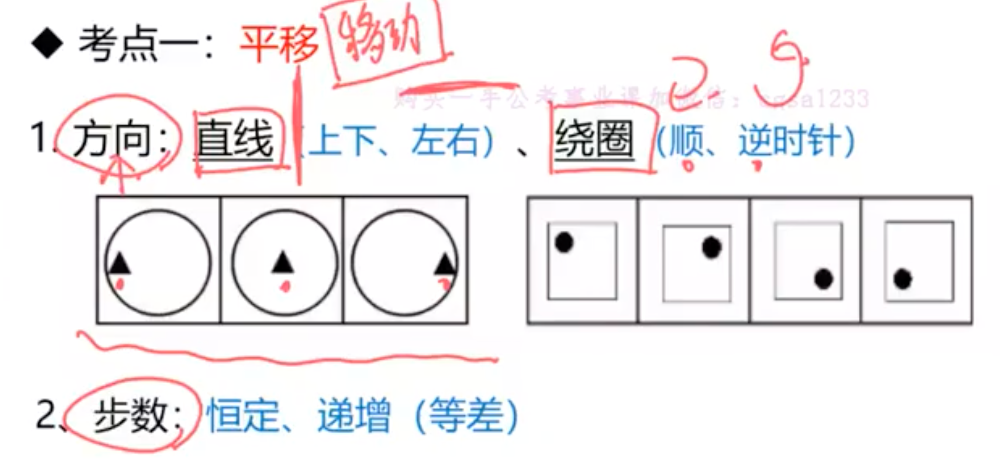
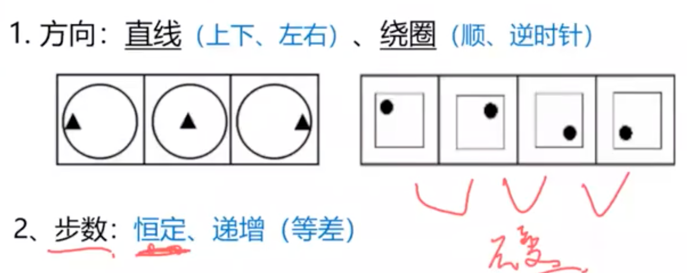
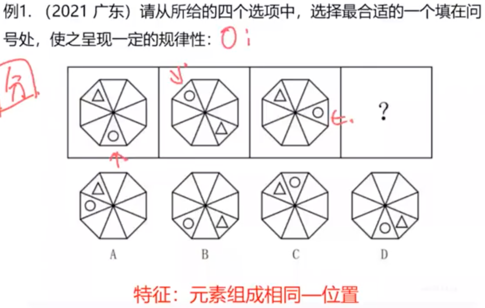

# 题型

| 类别        | 2023 下半年 | 2023 上半年 | 2022 下半年 | 2022 上半年 | 2021 下半年 | 2021 上半年 | 2020 上半年 |
|-----------------|--------------------------|--------------------------|--------------------------|--------------------------|--------------------------|--------------------------|--------------------------|
| 图形推理 | 5                       | 5                       | 5                       | 5                       | 5                       | 5                       | 5                       |
| 定义判断 | 5                       | 5                       | 5                       | 5                       | 5                       | 5                       | 5                       |
| 类比推理 | 10                      | 10                      | 10                      | 10                      | 10                      | 9                       | 10                      |
| 逻辑判断 | 10                      | 10                      | 10                      | 10                      | 10                      | 11                      | 10                      |
| 总题量  | 30                      | 30                      | 30                      | 30                      | 30                      | 30                      | 30                      |

## 图形推理

图形推理学习的重点
一、图形推理考什么?

1. 位置规律
2. 样式规律
3. 属性规律
4. 特殊规律
5. 数量规律
6. 空间规律

二、我怎么知道这道题考什么？

识别 图形特征

