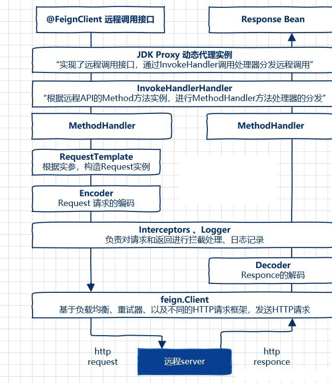

# 21、Feign 工作原理

主程序入口添加了@EnableFeignClients 注解开启对 FeignClient 扫描加载处理。根据Feign Client 的开发规范，定义接口并加@FeignClient 注解。当程序启动时，会进行包扫描，扫描所有@FeignClient 的注解的类，并且讲这些信息注入Spring IOC 容器中，当定义的的 Feign 接口中的方法被调用时，通过JDK 的代理方式，来生成具体的RequestTemplate.当生成代理时，Feign 会为每个接口方法创建一个 RequestTemplate。当生成代理时，Feign 会为每个接口方法创建一个 RequestTemplate 对象，该对象封装HTTP   请求需要的全部信息，如请求参数名，请求方法等信息都是在这个过程中确定的。然后RequestTemplate 生成 Request,然后把Request 交给Client 去处理，这里指的时Client 可以时JDK 原生的 URLConnection,Apache 的HttpClient,也可以时OKhttp，最后Client 被封装到 LoadBalanceClient 类，这个类结合 Ribbon 负载均衡发器服务之间的调用。

> 更新: 2024-05-01 16:07:07  
> 原文: <https://www.yuque.com/zhichangzhishiku/edrbqg/bp19gkf1262u4qez>