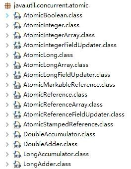

# 11、Atomic 原子类了解多少 原理是什么

Java 的原子类都存放在并发包java.util.concurrent.atomic 下，如下图

**基本类型**

● 使用原子的方式更新基本类型

● AtomicInteger：整型原子类

● AtomicLong：长整型原子类

● AtomicBoolean：布尔型原子类**数组类型**

● 使用原子的方式更新数组里的某个元素

● AtomicIntegerArray：整形数组原子类

● AtomicLongArray：长整形数组原子类

● AtomicReferenceArray：引用类型数组原子类**引用类型**

● AtomicReference：引用类型原子类

● AtomicStampedReference：原子更新引用类型里的字段原子类

● AtomicMarkableReference ：原子更新带有标记位的引用类型

● AtomicIntegerFieldUpdater：原子更新整形字段的更新器

● AtomicLongFieldUpdater：原子更新长整形字段的更新器

● AtomicStampedReference：原子更新带有版本号的引用类型。该类将整数值与引用关联起来，可用于解决原子的更新数据和数据的版本号，以及解决使用CAS 进行原子更新时可能出现的ABA 问题

(1) AtomicInteger 类利用CAS (Compare and Swap) + volatile + native 方法来保证原子操作，从而避免synchronized 的高开销，执行效率大为提升。

(2) CAS 的原理，是拿期望值和原本的值作比较，如果相同，则更新成新的值。UnSafe 类的objectFieldOffset() 方法是个本地方法，这个方法是用来拿“原值”的内存地址，返回值是valueOffset；另外，value 是一个volatile 变量，因此JVM 总是可以保证任意时刻的任何线程总能拿到该变量的最新值。

> 更新: 2024-04-30 18:22:13  
> 原文: <https://www.yuque.com/zhichangzhishiku/edrbqg/ppd9b7ykdys1ne5a>