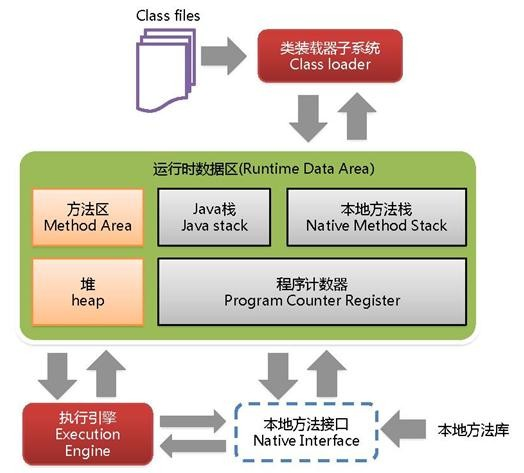
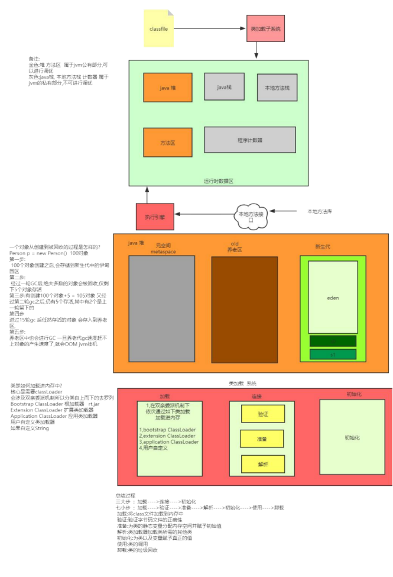

# 2、JVM 内存分哪几个区，每个区的作用是什么

java 虚拟机主要分为以下几个区

**(1)**** ****方法区**

l 有时候也成为永久代，在该区内很少发生垃圾回收，但是并不代表不发生GC，在这里进行的GC 主要是对方法区里的常量池和对类型的卸载

l 方法区主要用来存储已被虚拟机加载的类的信息、常量、静态变量和即时编译器编译后的代码等数据。

l 该区域是被线程共享的。

l 方法区里有一个运行时常量池，用于存放静态编译产生的字面量和符号引用。该常量池具有动态性，也就是说常量并不一定是编译时确定，运行时生成的常量也会存在这个常量池中。

**(2)**** ****虚拟机栈**

l 虚拟机栈也就是我们平常所称的栈内存,它为java 方法服务，每个方法在执行的时候都会创建一个栈帧，用于存储局部变量表、操作数栈、动态链接和方法出口等信息。

l 虚拟机栈是线程私有的，它的生命周期与线程相同。

l 局部变量表里存储的是基本数据类型、returnAddress 类型（指向一条字节码指令的地址）和对象引用，这个对象引用有可能是指向对象起始地址的一个指针，也有可能是代表对象的句柄或者与对象相关联的位置。局部变量所需的内存空间在编译器间确定

l 操作数栈的作用主要用来存储运算结果以及运算的操作数，它不同于局部变量表通过索引来访问，而是压栈和出栈的方式

l 每个栈帧都包含一个指向运行时常量池中该栈帧所属方法的引用，持有这个引用是为了支持方法调用过程中的动态连接.动态链接就是将常量池中的符号引用在运行期转化为直接引用。

**(3)**** ****本地方法栈**

本地方法栈和虚拟机栈类似，只不过本地方法栈为Native 方法服务。

**（4）**** ****堆**

java 堆是所有线程所共享的一块内存，在虚拟机启动时创建，几乎所有的对象实例都在这里创建，因此该区域经常发生垃圾回收操作。

**（5） 程序计数器：**

内存空间小，字节码解释器工作时通过改变这个计数值可以选取下一条需要执行的字节码指令，分支、循环、跳转、异常处理和线程恢复等功能都需要依赖这个计数器完成。该内存区域是唯一一个java 虚拟机规范没有规定任何OOM 情况的区域。

[https://openjdk.org/jeps/122](https://openjdk.org/jeps/122) 介绍静态变量、字符串常量从永久代移动到堆中

> 更新: 2024-04-30 16:54:25  
> 原文: <https://www.yuque.com/zhichangzhishiku/edrbqg/xyatzafra6u0vszb>