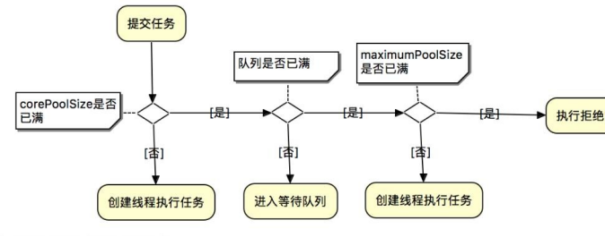

# 8、线程池底层工作原理

(1) 第一步：线程池刚创建的时候，里面没有任何线程，等到有任务过来的时候才会创建线程。当然也可以调用prestartAllCoreThreads() 或

者prestartCoreThread() 方法预创建corePoolSize 个线程

(2) 第二步：调用execute()提交一个任务时，如果当前的工作线程数

<corePoolSize，直接创建新的线程执行这个任务

(3) 第三步：如果当时工作线程数量>=corePoolSize，会将任务放入任务队列中缓存

(4) 第四步：如果队列已满，并且线程池中工作线程的数量<maximumPoolSize，还是会创建线程执行这个任务

(5) 第五步：如果队列已满，并且线程池中的线程已达到maximumPoolSize，这个时候会执行拒绝策略，JAVA 线程池默认的策略是AbortPolicy，即抛出RejectedExecutionException 异常

> 更新: 2024-04-30 18:19:34  
> 原文: <https://www.yuque.com/zhichangzhishiku/edrbqg/ar9eyc4fn0bmzeg6>