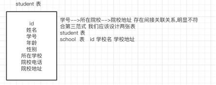

# 14、有没有设计过数据表?你是如何设计的

| 第一范式 | 每一列属性(字段)不可分割的,字段必须保证原子性 两列的属性值相近或者一样的,尽量合并到一列或者分表,确保数据不冗余 |
| :--- | :--- |
| 第二范式 | 每一行的数据只能与其中一行有关即主键 一行数据只能做一件事情或者表达一个意思, 只要数据出现重复,就要进行表的拆分 |
| 第三范式 | 数据不能存在传递关系,每个属性都跟主键有直接关联而不是间接关联 |

> 更新: 2024-05-01 16:25:57  
> 原文: <https://www.yuque.com/zhichangzhishiku/edrbqg/lt5kmlnbx9h6umfr>