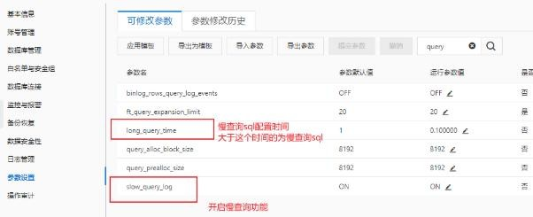
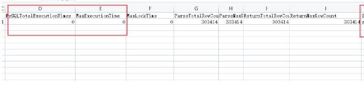
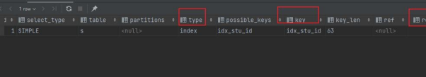

# 9、如何处理慢查询

在业务系统中，除了使用主键进行的查询，其他的都会在测试库上测试其耗时，慢查询的 统计主要由运维在做，会定期将业务中的慢查询反馈给我们。

慢查询的优化首先要搞明白慢的原因是什么?是查询条件没有命中索引?是加载了不需要的 数据列?还是数据量太大?

所以优化也是针对这三个方向来的

首先分析语句，看看是否加载了额外的数据，可能是查询了多余的行并且抛弃掉了，可能 是加载了许多结果中并不需要的列，对语句进行分析以及重写。

分析语句的执行计划，然后获得其使用索引的情况，之后修改语句或者修改索引，使得语 句可以尽可能的命中索引。

如果对语句的优化已经无法进行，可以考虑表中的数据量是否太大，如果是的话可以进行 横向或者纵向的分表。

**具体处理流程****（****阿里云****RDS**** ****为例）**

(1) 开启慢查询设置

(2) 日志管理导出慢查询文件

（3）测试环境通过explain 执行sql，主要关心以下字段

type：连接类型

key：MYSQL 使用的索引

rows：显示MYSQL 执行查询的行数，简单且重要，数值越大越不好，说明没有用好索引

extra：该列包含MySQL 解决查询的详细信息。

> 更新: 2024-05-01 16:21:03  
> 原文: <https://www.yuque.com/zhichangzhishiku/edrbqg/hs8goo17lzyxgez5>