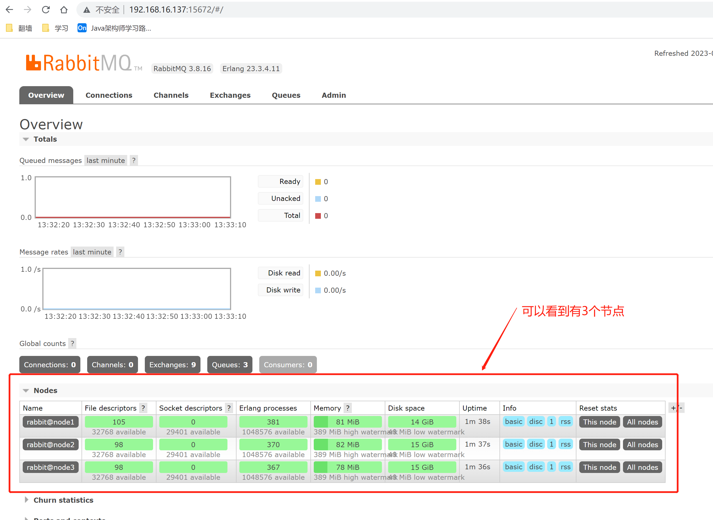
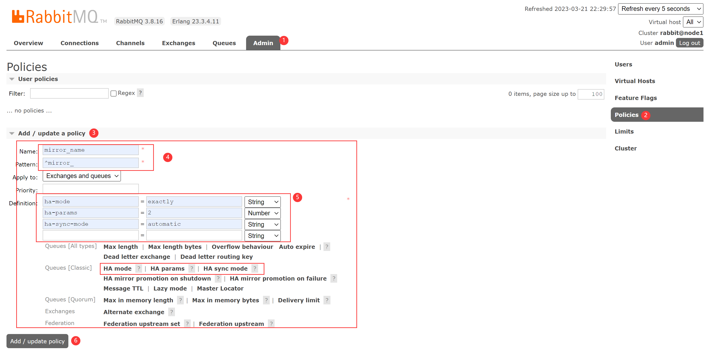
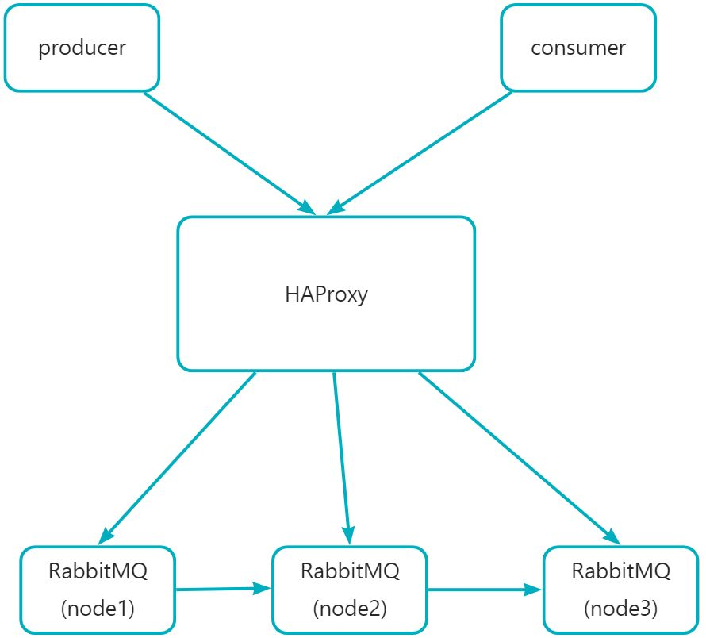
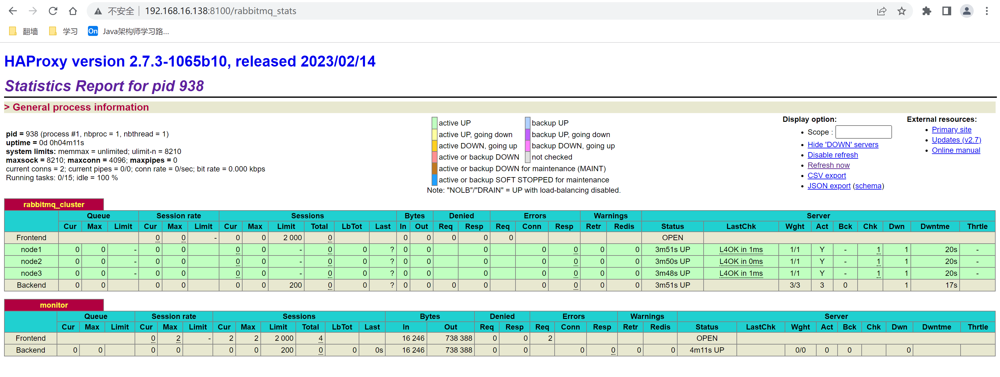
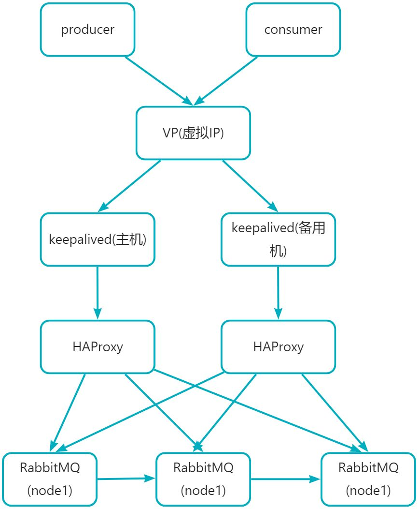
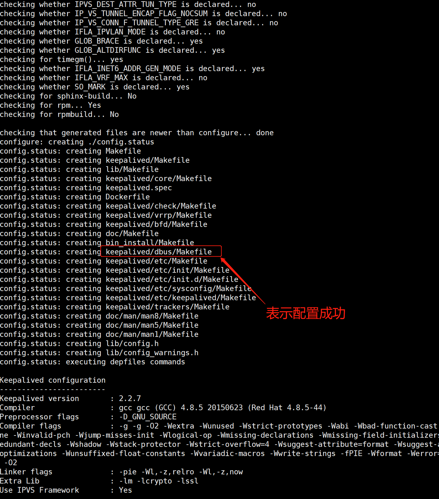
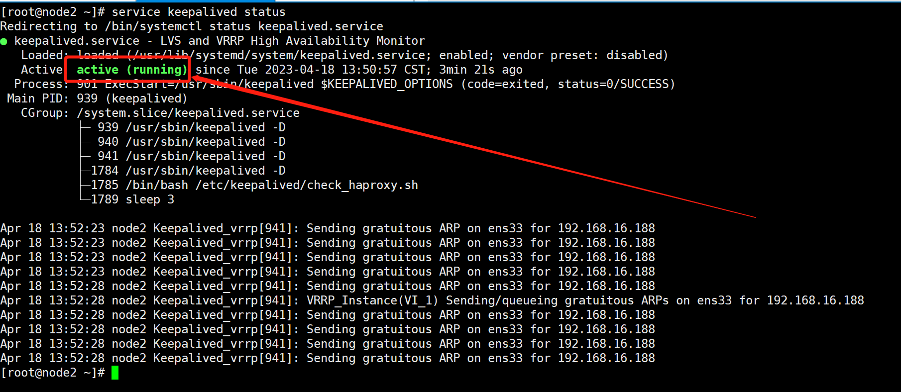
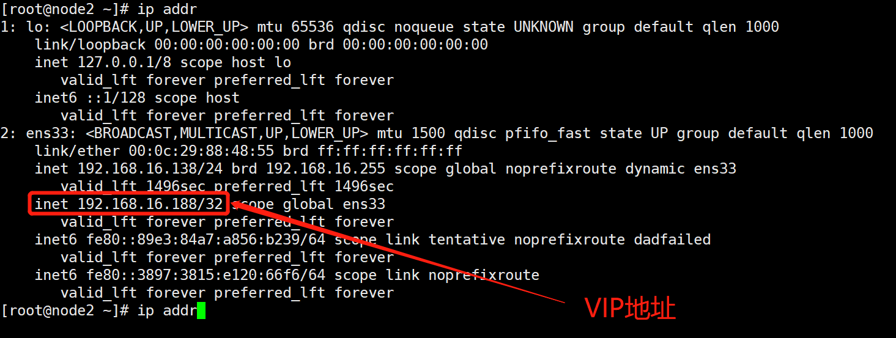

# RabbitMQ+HAProxy+Keepalived 搭建高可用RabbitMQ镜像模式集群

# 1.环境和版本准备
| 名称 | 版本号 | 查看命令 |
| --- | --- | --- |
| CentOS | CentOS Linux release 7.9.2009 (Core) | cat /etc/redhat-release |
| CentOS内核版本号 | Linux localhost.localdomain 3.10.0-1160.71.1.el7.x86_64 #1 SMP Tue Jun 28 15:37:28 UTC 2022 x86_64 x86_64 x86_64 GNU/Linux | uname -a |
| erlang | erlang-23.3.4.11-1.el7.x86_64 |  rpm -qa | grep erlang   |
| RabbitMQ | rabbitmq-server-3.8.16-1.el7.noarch |  rpm -qa | grep rabbitmq-server   |
| HAProxy | 2.7.3 | haproxy -v |
| keepalived | v1.3.5 | keepalived -v |


# <font style="color:rgb(77, 77, 77);">2.RabbitMQ</font>的安装
## 2.1文件下载
<font style="color:rgb(77, 77, 77);">RabbitMQ</font>：[https://packagecloud.io/rabbitmq/erlang/packages/el/7/erlang-23.3.4.11-1.el7.x86_64.rpm/](https://packagecloud.io/rabbitmq/erlang/packages/el/7/erlang-23.3.4.11-1.el7.x86_64.rpm/)

erlang：[https://packagecloud.io/rabbitmq/erlang/packages/el/7/erlang-23.3.4.11-1.el7.x86_64.rpm/download.rpm?distro_version_id=140](https://packagecloud.io/rabbitmq/erlang/packages/el/7/erlang-23.3.4.11-1.el7.x86_64.rpm/download.rpm?distro_version_id=140)

## 2.2安装文件：
### 2.2.1 安装命令
<font style="color:rgb(199, 37, 78);background-color:rgb(249, 242, 244);">rpm -ivh erlang-23.3.4.11-1.el7.x86_64.rpm  
</font><font style="color:rgb(199, 37, 78);background-color:rgb(249, 242, 244);">yum install socat -y</font>（需要联网）

<font style="color:rgb(199, 37, 78);background-color:rgb(249, 242, 244);">rpm -ivh rabbitmq-server-3.8.16-1.el7.noarch.rpm</font>

开机启动：<font style="color:rgb(199, 37, 78);background-color:rgb(249, 242, 244);">chkconfig rabbitmq-server on</font>

启动服务：<font style="color:rgb(199, 37, 78);background-color:rgb(249, 242, 244);">/sbin/service rabbitmq-server start</font>

查看服务状态：<font style="color:rgb(199, 37, 78);background-color:rgb(249, 242, 244);">/sbin/service rabbitmq-server status</font>

停止服务(选择执行)：<font style="color:rgb(199, 37, 78);background-color:rgb(249, 242, 244);">/sbin/service rabbitmq-server stop</font>

开启web管理插件（先将服务关闭掉）：<font style="color:rgb(199, 37, 78);background-color:rgb(249, 242, 244);">rabbitmq-plugins enable rabbitmq_management</font>

访问地址：[http://192.168.16.137:15672/](http://192.168.16.128:15672/)（默认端口号：15672），如果遇到访问不了，看看是否防火墙开着


关闭防火墙：<font style="color:rgb(199, 37, 78);background-color:rgb(249, 242, 244);">systemctl stop firewalld</font>

开机关闭防火墙：<font style="color:rgb(199, 37, 78);background-color:rgb(249, 242, 244);">systemctl disable firewalld</font>

查看防火墙状态：<font style="color:rgb(199, 37, 78);background-color:rgb(249, 242, 244);">systemctl status firewalld</font>

### 2.2.2添加一个新的用户：
1. 创建账号

<font style="color:rgb(199, 37, 78);background-color:rgb(249, 242, 244);">rabbitmqctl add_user admin 123456</font>

2. 设置用户角色

<font style="color:rgb(199, 37, 78);background-color:rgb(249, 242, 244);">rabbitmqctl set_user_tags admin administrator</font>

3. 设置用户权限

rabbitmqctl set_permissions [-p <vhostpath>] <user> <conf> <write> <read>

<font style="color:rgb(199, 37, 78);background-color:rgb(249, 242, 244);">rabbitmqctl set_permissions -p "/" admin ".*" ".*" ".*"</font>

用户admin具有/vhost1这个virtual host中所有的配置，写、读权限

4. 查询当前用户和角色

<font style="color:rgb(199, 37, 78);background-color:rgb(249, 242, 244);">rabbitmqctl list_users</font>

## 2.3生产者代码
```java
public class Producer {

    /**
     * 交换机名称
     */
    static String EXCHANGE_NAME = "xc_exchange_name_node";
    /**
     * 队列名称
     */
    static String QUEUE_NAME = "xc_queue_name_node";
    /**
     * 消息
     */
    static String message = "hello world node";

    public static void main(String[] args) throws Exception {

        //创建一个连接工厂
        ConnectionFactory factory = new ConnectionFactory();
        //服务地址
        factory.setHost("192.168.16.188");
        //账号
        factory.setUsername("admin");
        //密码
        factory.setPassword("123456");
        //端口
        //factory.setPort(5672);
        //创建连接
        Connection connection = factory.newConnection();
        //创建信道
        Channel channel = connection.createChannel();

        /**
         * 声明和创建交换机
         * 1.交换机的名称
         * 2.交换机的类型：direct、topic或者fanout和headers， headers类型的交换器的性能很差，不建议使用。
         * 3.指定交换机是否要持久化，如果设置为true，那么交换机的元数据要持久化到内存中
         * 4.指定交换机在没有队列与其绑定时，是否删除，设置为false表示不删除；
         * 5.Map<String, Object>类型，用来指定交换机其它一些结构化的参数，我在这里直接设置为null。
         */
        channel.exchangeDeclare(EXCHANGE_NAME, BuiltinExchangeType.DIRECT, true, true, null);

        /**
         * 生成一个队列
         * 1.队列的名称
         * 2.队列是否要持久化，但是需要注意，这里的持久化只是队列名称等这些队列元数据的持久化，不是队列中消息的持久化
         * 3.表示队列是不是私有的，如果是私有的，只有创建它的应用程序才能从队列消费消息；
         * 4.队列在没有消费者订阅时是否自动删除
         * 5.队列的一些结构化信息，比如声明死信队列、磁盘队列会用到。
         */
        channel.queueDeclare(QUEUE_NAME, true, false, false, null);

        /**
         * 将交换机和队列进行绑定
         * 1.队列名称
         * 2.交换机名称
         * 3.路由键，在直连模式下为队列名称。
         */
        channel.queueBind(QUEUE_NAME, EXCHANGE_NAME, QUEUE_NAME);

        /**
         * 发送消息
         * 1.发送到哪个交换机
         * 2.队列名称
         * 3.其他参数信息，MessageProperties.PERSISTENT_TEXT_PLAIN:可以让消息持久化
         * 4.发送消息的消息体
         */
        channel.basicPublish( EXCHANGE_NAME, QUEUE_NAME, null,  message.getBytes());

        channel.close();
        connection.close();
        System.out.println("发送消息");

    }
}
```

## 2.4消费者代码
```java
public class Consumer {

    public static void main(String[] args) throws Exception {

        //创建一个连接工厂
        ConnectionFactory factory = new ConnectionFactory();
        //服务地址
        factory.setHost("192.168.16.188");
        //账号
        factory.setUsername("admin");
        //密码
        factory.setPassword("123456");
        //端口
        //factory.setPort(5672);
        //创建连接
        Connection connection = factory.newConnection();
        //创建信道
        Channel channel = connection.createChannel();

        //接收消息回调
        DeliverCallback deliverCallback = (consumerTag, message)-> {
            try{
                System.out.println("接收到消息："+ new String(message.getBody()));
                /**
                 * 肯定确认应答
                 * 1.消息的标记Tag
                 * 2.是否批量应答 false表示不批量应答信道中的消息
                 */
                channel.basicAck(message.getEnvelope().getDeliveryTag(),false);
            } catch (Exception e) {
                e.printStackTrace();
            }

        };

        //取消消息回调
        CancelCallback cancelCallback = consumerTag ->{
            System.out.println("消费消息被中断");
        };

        /**
         * 消费消息
         * 1.消费哪个队列
         * 2.消费成功之后是否要自动应答，true:自动应答
         * 3.消费者未成功消费的回调
         * 4.消费者取消消费的回调
         */
        channel.basicConsume("xc_queue_name_node", false, deliverCallback, cancelCallback);
    }
}

```

# 3.<font style="color:rgb(77, 77, 77);">RabbitMQ</font>集群搭建


1. 首先通过克隆的方式，从第一台安装好<font style="color:rgb(77, 77, 77);">RabbitMQ</font>的服务器环境克隆出两台机器
2. 修改克隆出的2台RabbitMq服务器的Ip地址，修改IP(可不修改，通过ifconfig或者ip addr查看ip地址)  
只需修改/etc/sysconfig/network-scripts/ifcfg-ens33文件中的IPADDR即可。
3. 修改3台RabbitMq服务器的hostname  
<font style="color:rgb(77, 77, 77);">3台服务器的hostname分别设置为node1、node2、node3</font>；

<font style="color:rgb(199, 37, 78);background-color:rgb(249, 242, 244);">vi /etc/hostname</font>

设置后一定要对服务进行重启，重启命令：<font style="color:rgb(199, 37, 78);background-color:rgb(249, 242, 244);">reboot</font>

4. 分别修改3台Rabbitmq服务器的节点的hosts文件

<font style="color:rgb(199, 37, 78);background-color:rgb(249, 242, 244);">vi /etc/hosts</font>

在hosts文件后面追加

<font style="color:rgb(152, 195, 121);">192.168.16.137 node1</font>

<font style="color:rgb(152, 195, 121);">192.168.16.138 node2</font>

<font style="color:rgb(152, 195, 121);">192.168.16.139 node3</font>

5.  把第1个节点上的cookie文件复制到另外2台克隆的节点上，确保各节点用的同一个cookie

在node1上执行下面2条命令，把node1节点上的cookie文件复制到node2和node3上。

<font style="color:rgb(199, 37, 78);background-color:rgb(249, 242, 244);">scp /var/lib/rabbitmq/.erlang.cookie root@node2:/var/lib/rabbitmq/.erlang.cookie</font>

<font style="color:rgb(199, 37, 78);background-color:rgb(249, 242, 244);">scp /var/lib/rabbitmq/.erlang.cookie root@node3:/var/lib/rabbitmq/.erlang.cookie</font>

6. 启动 RabbitMQ 服务,顺带启动 Erlang 虚拟机和 RbbitMQ 应用服务

分别在3个节点上执行以下命令

<font style="color:rgb(199, 37, 78);background-color:rgb(249, 242, 244);">rabbitmq-server -detached</font>

7. 在节点2执行

<font style="color:rgb(199, 37, 78);background-color:rgb(249, 242, 244);">rabbitmqctl stop_app </font>(rabbitmqctl stop_会将Erlang虚拟机关闭，rabbitmqctl stop_app只会关闭rabbitmq服务)

<font style="color:rgb(199, 37, 78);background-color:rgb(249, 242, 244);">rabbitmqctl reset</font>

<font style="color:rgb(199, 37, 78);background-color:rgb(249, 242, 244);"> rabbitmqctl join_cluster rabbit</font><font style="color:rgb(199, 37, 78);background-color:rgb(249, 242, 244);">@node1</font>

<font style="color:rgb(199, 37, 78);background-color:rgb(249, 242, 244);"> rabbitmqctl start_app</font>（只启动应用服务）

8. 在节点3执行

<font style="color:rgb(199, 37, 78);background-color:rgb(249, 242, 244);">rabbitmqctl stop_app </font>

<font style="color:rgb(199, 37, 78);background-color:rgb(249, 242, 244);">rabbitmqctl reset</font>

<font style="color:rgb(199, 37, 78);background-color:rgb(249, 242, 244);">rabbitmqctl join_cluster rabbit@node2</font>

<font style="color:rgb(199, 37, 78);background-color:rgb(249, 242, 244);">rabbitmqctl start_app</font>

9. 集群状态

<font style="color:rgb(199, 37, 78);background-color:rgb(249, 242, 244);">rabbitmqctl cluster_status</font>

10. 需要重新设置用户(只需要在一台机器上运行)
    1. 创建账号

<font style="color:rgb(199, 37, 78);background-color:rgb(249, 242, 244);">rabbitmqctl add_user admin 123456</font>

    2. 设置用户角色

<font style="color:rgb(199, 37, 78);background-color:rgb(249, 242, 244);">rabbitmqctl set_user_tags admin administrator</font>

    3. 设置用户权限

<font style="color:rgb(199, 37, 78);background-color:rgb(249, 242, 244);">rabbitmqctl set_permissions -p "/" admin ".*" ".*" ".*"</font>

11. 验证

访问：[http://192.168.16.137:15672/](http://192.168.16.137:15672/)，如下图即表示搭建成功



12. 解除集群节点(node2和node3机器分别执行)

<font style="color:rgb(199, 37, 78);background-color:rgb(249, 242, 244);">rabbitmqctl stop_app </font>

<font style="color:rgb(199, 37, 78);background-color:rgb(249, 242, 244);">rabbitmqctl reset</font>

<font style="color:rgb(199, 37, 78);background-color:rgb(249, 242, 244);">rabbitmqctl start_app</font>

<font style="color:rgb(199, 37, 78);background-color:rgb(249, 242, 244);">rabbitmqctl cluster_status</font>

<font style="color:rgb(199, 37, 78);background-color:rgb(249, 242, 244);">rabbitmqctl forget_cluster_node rabbit@node2</font>(node1节点上执行)

# 4. 镜像队列
## 4.1使用镜像队列的原因
+ <font style="color:rgb(34, 34, 34);">虽然集群共享队列，但在默认情况下，消息只会被路由到某一个节点的符合条件的队列上，并不会同步到其他节点的相同队列上。</font>
+ <font style="color:rgb(34, 34, 34);">假设消息路由到 node1 的 my-queue 队列上，但是 node1 突然宕机了，那么消息就会丢失</font>
+ <font style="color:rgb(34, 34, 34);">想要解决这个问题，需要开启队列镜像，将集群中的队列彼此之间进行镜像，此时消息就会被拷贝到处于同一个镜像分组中的所有队列上。</font>

## 4.2 管理界面配置参数


**参数解释**：

+ **Name**: policy的名称，用户自定义。
+ **Pattern**: queue的匹配模式（正则表达式）。^表示所有队列都是镜像队列。
+ **Definition**: 镜像定义，包括三个部分ha-sync-mode、ha-mode、ha-params。
    - **ha-mode**: 指明镜像队列的模式，有效取值范围为all/exactly/nodes。
        * **all**：表示在集群所有的代理上进行镜像。
        * **exactly**：表示在指定个数的代理上进行镜像，代理的个数由ha-params指定。
        * **nodes**：表示在指定的代理上进行镜像，代理名称通过ha-params指定。
    - **ha-params**: ha-mode模式需要用到的参数。
    - **ha-sync-mode**: 表示镜像队列中消息的同步方式，有效取值范围为：automatic，manually。
        * **automatic**：表示自动向master同步数据。
        * **manually**：表示手动向master同步数据。
+ **Priority**: 可选参数， policy的优先级。

# 5. 负载均衡-HAProxy
## 5.1HAProxy概述
+ <font style="color:rgb(77, 77, 77);">一种高效、可靠、免费的高可用及</font>**<font style="color:rgb(77, 77, 77);">负载均衡</font>**<font style="color:rgb(77, 77, 77);">软件，非常适合于高负载站点的七层数据请求。客户端通过Haproxy代理服务器获得站点页面，而代理服务器收到客户请求后根据负载均衡的规则将请求数据转发给后端真实服务器</font>
+ <font style="color:rgb(77, 77, 77);">实现了一种事件驱动、单一进程模型，能支持非常大的并发连接数</font>



## 5.2安装HAProxy
1. 下载依赖包

<font style="color:rgb(199, 37, 78);background-color:rgb(249, 242, 244);">yum install gcc vim wget</font>

2. 下载haproxy源码包

<font style="color:rgb(199, 37, 78);background-color:rgb(249, 242, 244);">wget </font>[https://src.fedoraproject.org/repo/pkgs/haproxy/haproxy-2.7.3.tar.gz/sha512/f9eeee2d232fd2f4da1959e9265dd6abe6c6182109a0455d4f868a516e78cc6ea67e8456d5bc26e439385d17f52e4b179d7c615bacf15aeae901ab8e172dc758/haproxy-2.7.3.tar.gz](https://src.fedoraproject.org/repo/pkgs/haproxy/haproxy-2.7.3.tar.gz/sha512/f9eeee2d232fd2f4da1959e9265dd6abe6c6182109a0455d4f868a516e78cc6ea67e8456d5bc26e439385d17f52e4b179d7c615bacf15aeae901ab8e172dc758/haproxy-2.7.3.tar.gz)

(源码包下载地址：[https://src.fedoraproject.org/repo/pkgs/haproxy/](https://src.fedoraproject.org/repo/pkgs/haproxy/))

3. 解压

<font style="color:rgb(199, 37, 78);background-color:rgb(249, 242, 244);">tar -zxvf haproxy-2.7.3.tar.gz -C /usr/local</font>

4. 进入目录，进行编辑、安装

<font style="color:rgb(199, 37, 78);background-color:rgb(249, 242, 244);">cd /usr/local/haproxy-2.7.3</font>

<font style="color:rgb(199, 37, 78);background-color:rgb(249, 242, 244);">make TARGET=linux30 PREFIX=/usr/local/haproxy</font>

<font style="color:rgb(199, 37, 78);background-color:rgb(249, 242, 244);">make install PREFIX=/usr/local/haproxy</font>

创建文件夹：<font style="color:rgb(199, 37, 78);background-color:rgb(249, 242, 244);">mkdir /etc/haproxy</font>

5. 赋权

<font style="color:#000000;background-color:rgb(249, 242, 244);">--创建组</font>

<font style="color:rgb(199, 37, 78);background-color:rgb(249, 242, 244);">groupadd -r -g 149 haproxy</font>

<font style="color:#000000;background-color:rgb(249, 242, 244);">--创建用户</font>

<font style="color:rgb(199, 37, 78);background-color:rgb(249, 242, 244);">useradd -g haproxy -r -s /sbin/nologin -u 149  haproxy</font>

6. 创建配置文件

<font style="color:rgb(199, 37, 78);background-color:rgb(249, 242, 244);">vim /etc/haproxy/haproxy.cfg</font>

```shell
#全局配置
global
    #设置日志
    log 127.0.0.1 local0 info
    #当前工作目录
    chroot /usr/local/haproxy
    #用户与用户组
    user haproxy
    group haproxy
    #运行进程ID
    uid 99
    gid 99
    #守护进程启动
    daemon
    #最大连接数
    maxconn 4096

#默认配置
defaults
    #应用全局的日志配置
    log global
    #默认的模式mode {tcp|http|health}
    #TCP是4层，HTTP是7层，health只返回OK
    mode tcp
    #日志类别tcplog
    option tcplog
    #不记录健康检查日志信息
    option dontlognull
    #3次失败则认为服务不可用
    retries 3
    #每个进程可用的最大连接数
    maxconn 2000
    #连接超时
    timeout connect 5s
    #客户端超时
    timeout client 120s
    #服务端超时
    timeout server 120s

#绑定配置
listen rabbitmq_cluster 
        bind 192.168.16.138:5671
        #配置TCP模式
        mode tcp
        #简单的轮询
        balance roundrobin
        #RabbitMQ集群节点配置
          #check表示开启健康检查
          #inter 5000表示每隔5秒进行一次健康检查
          #rise 2表示当服务器被连续检测2次成功后标记为健康
          #fall 2表示当服务器被连续检测2次失败后标记为不健康
        server node1 192.168.16.137:5672 check inter 5000 rise 2 fall 2
        server node2 192.168.16.138:5672 check inter 5000 rise 2 fall 2
        server node3 192.168.16.139:5672 check inter 5000 rise 2 fall 2

#haproxy监控页面地址
listen monitor 
        bind 192.168.16.138:8100
        mode http
        option httplog
        stats enable
				#项目名为rabbitmq_stats，ip+端口+项目名即可访问
        stats uri /rabbitmq_stats
				#自动刷新时间
        stats refresh 5s
```

7. 配置启动文件复制 haproxy 文件到 /usr/sbin 下 ，复制 haproxy 脚本，到 /etc/init.d 下

<font style="color:rgb(199, 37, 78);background-color:rgb(249, 242, 244);"> cp /usr/local/haproxy/sbin/haproxy /usr/sbin/  
</font><font style="color:rgb(199, 37, 78);background-color:rgb(249, 242, 244);"> cp /usr/local/haproxy-2.7.3/examples/haproxy.init /etc/init.d/haproxy  
</font><font style="color:rgb(199, 37, 78);background-color:rgb(249, 242, 244);"> chmod 755 /etc/init.d/haproxy </font>

8. 启动

<font style="color:rgb(199, 37, 78);background-color:rgb(249, 242, 244);">  service haproxy start|stop|restart|reload|condrestart|status|check </font>

9. <font style="color:rgb(51, 51, 51);">设置成开机启动</font>

<font style="color:rgb(199, 37, 78);background-color:rgb(249, 242, 244);">  chkconfig haproxy on</font>

10. <font style="color:rgb(51, 51, 51);">验证</font>

访问：[http://192.168.16.138:8100/rabbitmq_stats](http://192.168.16.138:8100/rabbitmq_stats)，如下图即表示安装成功



# 6. 高可用-keepalived


安装我们keepalived之前，我们再多安装一台HAProxy

## <font style="color:rgb(51, 51, 51);">6.1 安装keepalived</font>
### 第一种安装方式
<font style="color:rgb(199, 37, 78);background-color:rgb(249, 242, 244);">yum install keepalived</font>

### 第二种安装方式
下载地址<font style="color:rgb(51, 51, 51);">：</font>[https://www.keepalived.org/download.html](https://www.keepalived.org/download.html)

下载依赖包：<font style="color:rgb(199, 37, 78);background-color:rgb(249, 242, 244);">yum -y install openssl openssl-devel</font>

解压：<font style="color:rgb(199, 37, 78);background-color:rgb(249, 242, 244);">tar -zxvf keepalived-2.2.7.tar.gz </font>

跳转目录：<font style="color:rgb(199, 37, 78);background-color:rgb(249, 242, 244);">cd keepalived-2.2.7</font>

指定安装和配置文件路径：<font style="color:rgb(199, 37, 78);background-color:rgb(249, 242, 244);">./configure --prefix=/usr/local/keepalived --sysconf=/etc</font>

<font style="color:rgb(51, 51, 51);">注释：--prefix=/etc/keepalived   ：指定安装在/usr/local/keepalived 路径下</font>

<font style="color:rgb(51, 51, 51);">    --sysconf=/etc/keepalived ： 指定keepalived的conf配置文件路径</font>

<font style="color:rgb(51, 51, 51);">出现</font>**<font style="color:rgb(51, 51, 51);">keepalived/dbus/Makefile</font>**<font style="color:rgb(51, 51, 51);"> 表示配置成功</font>



编译加安装：<font style="color:rgb(97, 97, 97);"> </font><font style="color:rgb(199, 37, 78);background-color:rgb(249, 242, 244);">make && make install </font>

跳目录：<font style="color:rgb(199, 37, 78);background-color:rgb(249, 242, 244);">cd /etc/keepalived/</font>

重命名：<font style="color:rgb(199, 37, 78);background-color:rgb(249, 242, 244);">mv keepalived.conf.sample keepalived.conf</font>

## 6.2 修改配置文件
<font style="color:rgb(51, 51, 51);">主机和备机稍有不同，已经在配置文件中声明,请详细阅读！</font>

编辑文件：<font style="color:rgb(199, 37, 78);background-color:rgb(249, 242, 244);">vim /etc/keepalived/keepalived.conf</font>

<font style="color:rgb(79, 79, 79);">全选并删除</font>

+ <font style="color:rgba(0, 0, 0, 0.75);">全选 </font><font style="color:rgb(199, 37, 78);background-color:rgb(249, 242, 244);">ggvG</font>
+ <font style="color:rgba(0, 0, 0, 0.75);">删除选中部分 </font><font style="color:rgb(199, 37, 78);background-color:rgb(249, 242, 244);">d</font>

MASTER 

```shell
global_defs {
  router_id NodeA #路由ID, 主备的ID不能相同
  }
  
  #自定义监控脚本
  vrrp_script chk_haproxy {
    script "/etc/keepalived/check_haproxy.sh"
    interval 5 #运行脚本的间隔时间，秒
    weight 2 #权重
  }
  
  vrrp_instance VI_1 {
    state MASTER #Keepalived的角色。MASTER表示主服务器，从服务器设置为BACKUP
    interface ens33 #指定监测网卡（ifconfig查看）
    virtual_router_id 1
    priority 100 #优先级，BACKUP机器上的优先级要小于这个值
    advert_int 1 #设置主备之间的检查时间，单位为s
    authentication { #定义验证类型和密码
      auth_type PASS
      auth_pass root123
    }
    track_script {
    	chk_haproxy
    }
    virtual_ipaddress { 
    	192.168.16.188 #设置虚拟IP地址，即VIP,可以设置多个，每行一个
    }
}
```

BACKUP

```shell
global_defs {
  router_id NodeB #路由ID, 主备的ID不能相同
  }
  
  #自定义监控脚本
  vrrp_script chk_haproxy {
    script "/etc/keepalived/check_haproxy.sh"
    interval 5
    weight 2
  }
  
  vrrp_instance VI_1 {
    state BACKUP #Keepalived的角色。MASTER表示主服务器，从服务器设置为BACKUP
    interface ens33 #指定监测网卡（ifconfig查看）
    virtual_router_id 1
    priority 90 #优先级，BACKUP机器上的优先级要小于这个值
    advert_int 1 #设置主备之间的检查时间，单位为s
    authentication { #定义验证类型和密码
      auth_type PASS
      auth_pass 123456
    }
    track_script {
    	chk_haproxy
    }
    virtual_ipaddress { 
    	192.168.16.188 #设置虚拟IP地址，即VIP,可以设置多个，每行一个
    }
}
```

<font style="color:rgb(51, 51, 51);">为了防止HAProxy服务挂了，但是Keepalived却还在正常工作而没有切换到Backup上，所以这里需要编写一个脚本来检测HAProxy服务的状态。当HAProxy服务挂掉之后该脚本会自动重启HAProxy的服务，如果不成功则关闭Keepalived服务，如此便可以切换到Backup继续工作。这个脚本就对应了上面配置中vrrp_script chk_haproxy{}的script对应的值，/etc/keepalived/check_haproxy.sh的内容如代码清单所示。</font>

编辑文件：<font style="color:rgb(199, 37, 78);background-color:rgb(249, 242, 244);">vim /etc/keepalived/check_haproxy.sh</font>

```shell
#!/bin/bash
#判断HAProxy是否已经启动
if [ $(ps -C haproxy --no-header | wc -l) -eq 0 ];then
#如果没有启动，则启动
service keepalived start
fi
#睡眠3秒，以便HAProxy完全启动
sleep 3
#如果HAProxy还是没有完全启动，此时需要将本地的keppalived服务停掉，以便让VIP自动漂移到另外一台HAProxy
if [ $(ps -C haproxy --no-header | wc -l) -eq 0 ];then
service keepalived stop
fi
```

<font style="color:rgb(51, 51, 51);">给脚本增加执行权限</font>

<font style="color:rgb(199, 37, 78);background-color:rgb(249, 242, 244);">chmod +x /etc/keepalived/check_haproxy.sh</font>

<font style="color:rgb(51, 51, 51);">查看状态</font>

<font style="color:rgb(199, 37, 78);background-color:rgb(249, 242, 244);">service keepalived status</font>

<font style="color:rgb(51, 51, 51);">设置成开机启动</font>

<font style="color:rgb(199, 37, 78);background-color:rgb(249, 242, 244);">chkconfig keepalived on</font>

## <font style="color:rgb(51, 51, 51);">6.3 启动服务</font>
<font style="color:rgb(51, 51, 51);">因为是为了实现haproxy的高可用，启动时需要顺序启动：</font>

1. <font style="color:rgb(51, 51, 51);">启动两个节点的haproxy</font>

<font style="color:rgb(199, 37, 78);background-color:rgb(249, 242, 244);">service haproxy start</font>

2. <font style="color:rgb(51, 51, 51);">启动keeepalived：先启动master节点，后启动BACKUP节点</font>  
<font style="color:rgb(199, 37, 78);background-color:rgb(249, 242, 244);">service keepalived start</font>
3. 查看keepalived状态,运行如下命令，如图所示，即表示安装成功

<font style="color:rgb(199, 37, 78);background-color:rgb(249, 242, 244);">service keepalived status</font>



4. 查看VIP地址<font style="color:rgb(77, 77, 77);">(</font>虚拟IP)是否生效，再master节点上执行，如图即表示成功

<font style="color:rgb(199, 37, 78);background-color:rgb(249, 242, 244);">ip addr</font>



  
 


> 更新: 2023-04-20 15:02:48  
> 原文: <https://www.yuque.com/tulingzhouyu/sfx8p0/tvhd8nde1ug2vf4q>