# 5、Spring AOT提前优化

## AOT之什么是AOT
一种编译方式的变革！旨在提升启动速度！


 <font style="color:rgb(77, 77, 77);">JIT，即Just-in-time,动态(即时)编译，运行时编译；</font>

<font style="color:rgb(77, 77, 77);">AOT，Ahead Of Time，指运行前编译，是两种程序的编译方式</font>

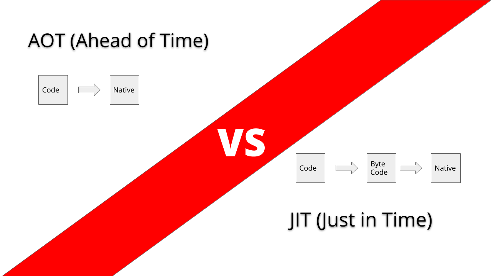

## 
## AOT之什么是GraalVM
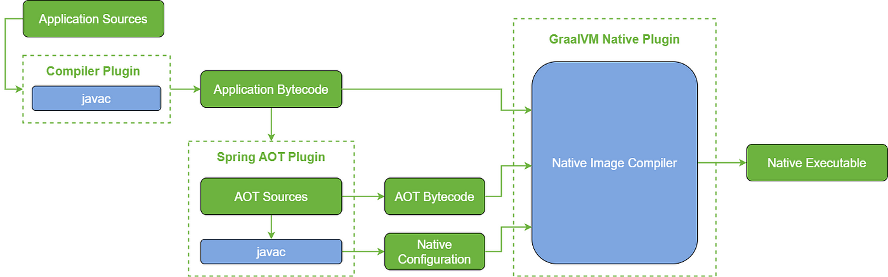

GraalVM旨在加速Java应用程序的性能，同时消耗更少的资源。GraalVM提供了两种运行Java应用程序的方式：在HotSpot JVM上使用Graal即时编译器或作为预先编译的本地可执行文件（AOT）。除了Java，它还提供了JavaScript、Ruby、Python和许多其他流行语言的运行时。GraalVM的多语言能力使得可以在单个应用程序中混合编程语言，同时消除不同语言之间调用的成本。

GraalVM文章推荐：[https://mp.weixin.qq.com/mp/appmsgalbum?__biz=MzI3MDI5MjI1Nw==&action=getalbum&album_id=2761361634840969217&scene=173&from_msgid=2247484273&from_itemidx=1&count=3&nolastread=1#wechat_redirect](https://mp.weixin.qq.com/mp/appmsgalbum?__biz=MzI3MDI5MjI1Nw==&action=getalbum&album_id=2761361634840969217&scene=173&from_msgid=2247484273&from_itemidx=1&count=3&nolastread=1#wechat_redirect)

## GraalVM体验
### 下载压缩包
打开[https://github.com/graalvm/graalvm-ce-builds/releases](https://github.com/graalvm/graalvm-ce-builds/releases)，按JDK版本下载GraalVM对应的压缩包，请下载**<font style="color:#DF2A3F;">Java 17对应</font>**的版本，不然后面运行SpringBoot3可能会有问题。

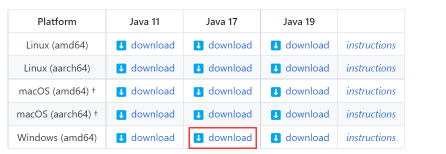


windows的同学直接给大家：[附件: graalvm-ce-java17-windows-amd64-22.3.0.zip](./attachments/6CQMBlz9kKa_dSzO/graalvm-ce-java17-windows-amd64-22.3.0.zip)


下载完后，就解压，

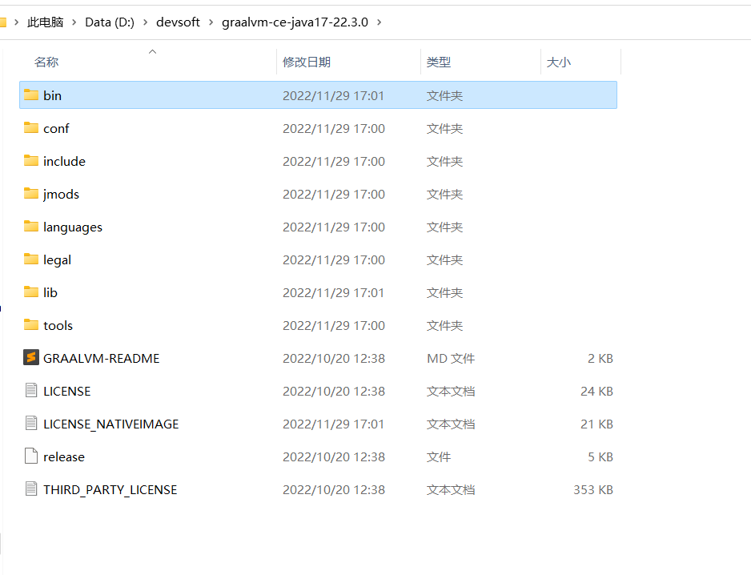


### 配置环境变量
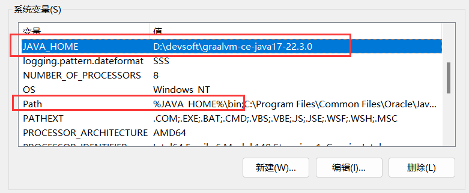


新开一个cmd测试：

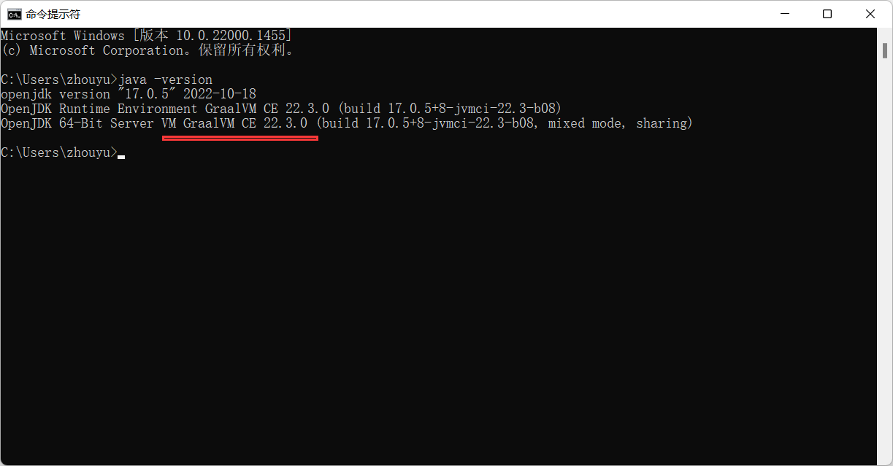


### 安装<font style="color:rgb(41, 41, 41);">Visual Studio Build Tools</font>
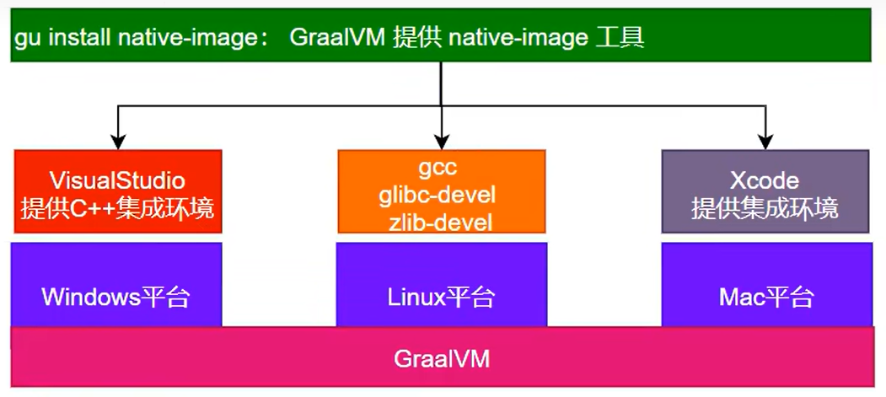

 

<font style="color:rgb(41, 41, 41);"></font>

<font style="color:rgb(41, 41, 41);">打开</font>[visualstudio.microsoft.com](https://visualstudio.microsoft.com/thank-you-downloading-visual-studio/?sku=BuildTools&rel=16)，下载Visual Studio Installer。


选择C++桌面开发，和Windows 11 SDK，然后进行下载和安装，安装后重启操作系统。

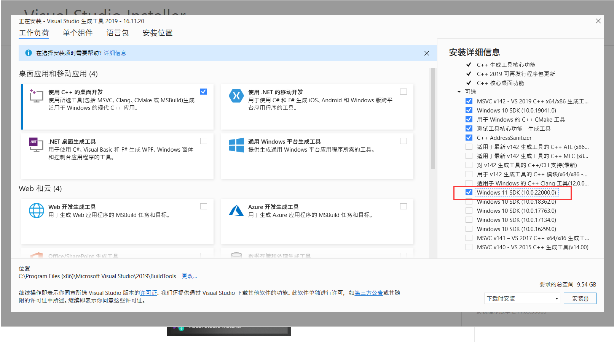

## 
要使用GraalVM，不能使用普通的windows自带的命令行窗口，得使用VS提供的** x64 Native Tools Command Prompt for VS 2019**<font style="color:rgb(25, 30, 30);">，如果没</font>有可以执行`C:\Program Files (x86)\Microsoft Visual Studio\2019\BuildTools\VC\Auxiliary\Build\vcvars64.bat`脚本来安装。


安装完之后其实就可以在<font style="color:rgb(25, 30, 30);"> </font>**<font style="color:rgb(25, 30, 30);">x</font>****64 Native Tools Command Prompt for VS 2019**中去使用`native-image`命令去进行编译了。

<font style="color:rgb(41, 41, 41);background-color:rgb(242, 242, 242);"></font>

但是，如果后续在编译过程中编译失败了，出现以下错误：

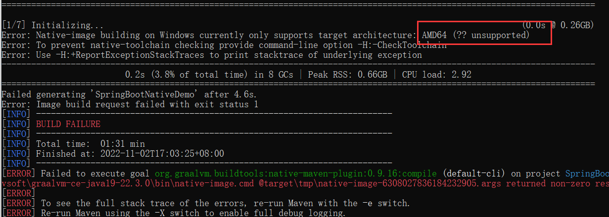


那么可以执行cl.exe，如果是中文，那就得修改为英文。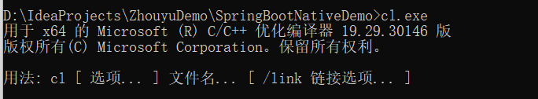


通过Visual Studio Installer来修改，比如：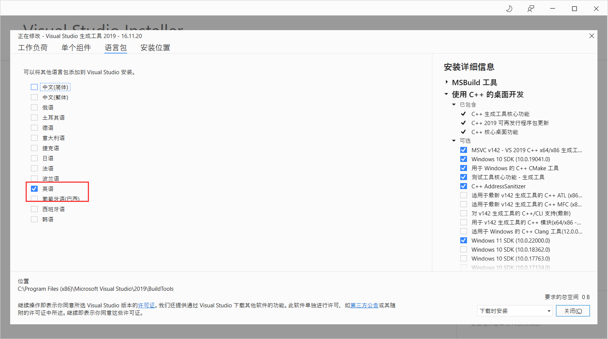

可能一开始只选择了中文，手动选择英文，去掉中文，然后安装即可。


再次检查

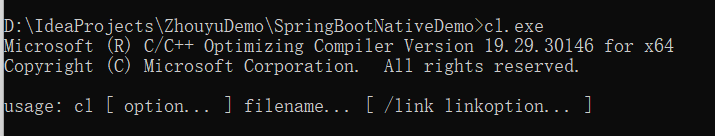


这样就可以正常的编译了。


### Hello World实战
新建一个简单的Java工程：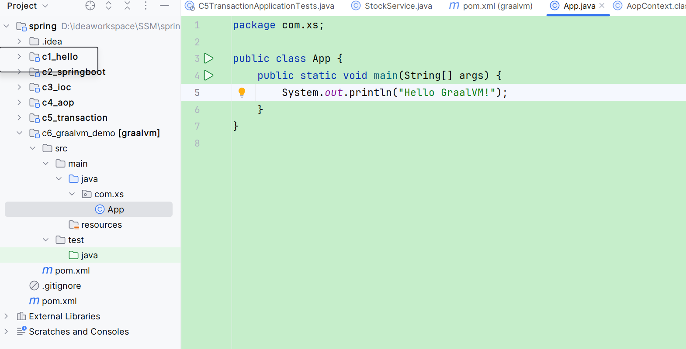


我们可以直接把graalvm当作普通的jdk的使用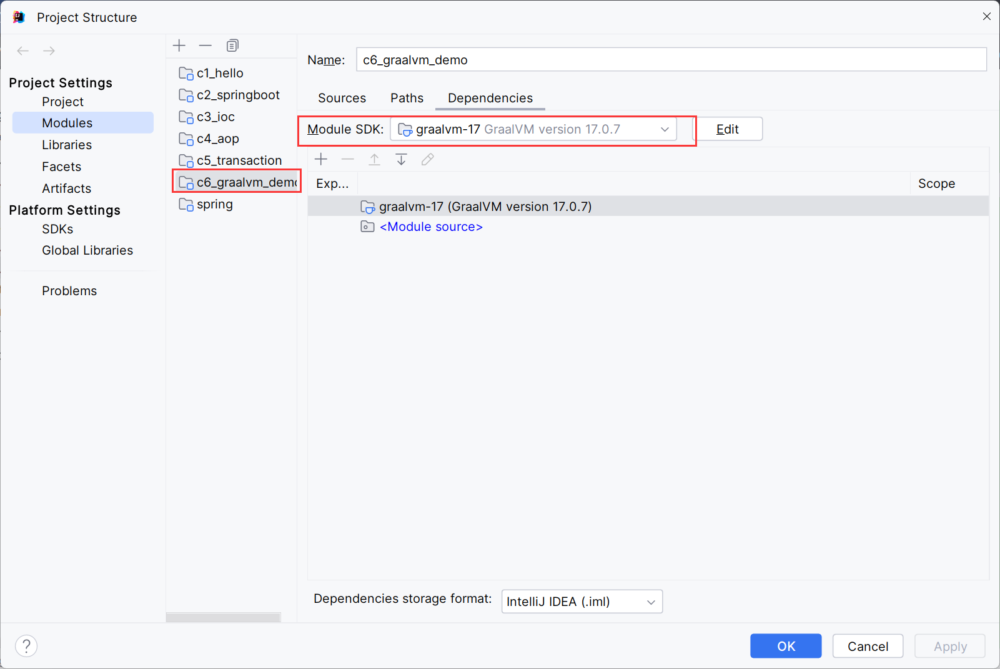


我们也可以利用native-image命令来将字节码编译为二进制可执行文件。


打开**x64 Native Tools Command Prompt for VS 2019**，进入工程目录下，并利用javac将java文件编译为class文件：`javac -d . src/com/xs/App.java`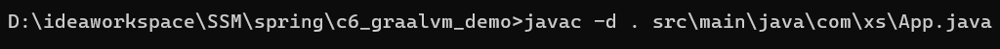


此时的class文件因为有main方法，所以用java命令可以运行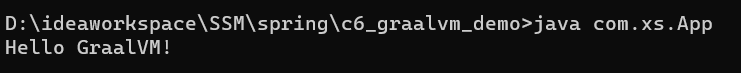


我们也可以利用native-image来编译：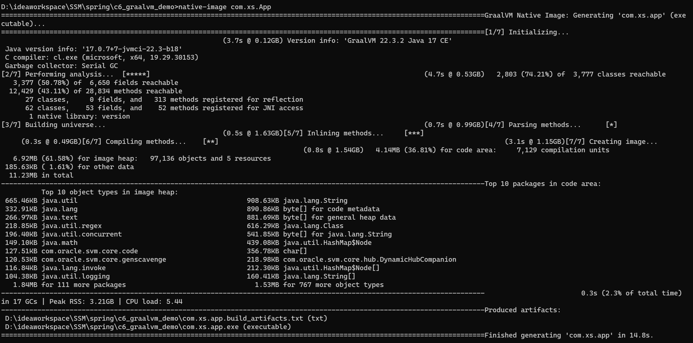

 


编译完了之后就会在当前目录生成一个exe文件：

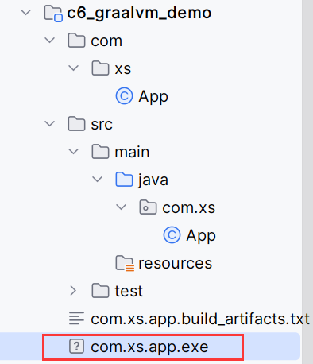


我们可以直接运行这个exe文件：


并且**<font style="color:#DF2A3F;">运行这个exe文件是不需要操作系统上安装了JDK环境的。</font>**

**<font style="color:#DF2A3F;"></font>**

我们可以使用-o参数来指定exe文件的名字：

```java
native-image com.xs.App -o app
```

### 


## SpringBoot 3.0实战
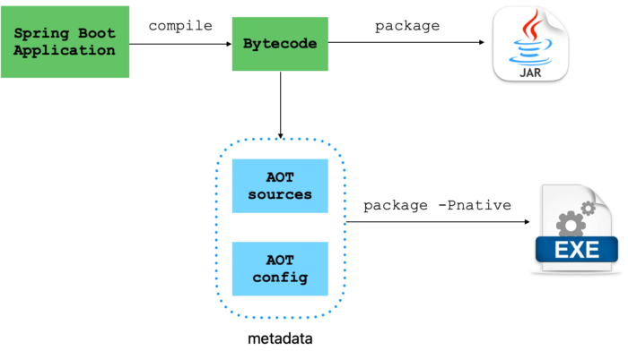


然后新建一个Maven工程，添加SpringBoot依赖

```xml
<parent>
	<groupId>org.springframework.boot</groupId>
	<artifactId>spring-boot-starter-parent</artifactId>
	<version>3.0.0</version>
</parent>
 
```


以及SpringBoot的插件

```xml
<build>
	<plugins>
		<plugin>
			<groupId>org.graalvm.buildtools</groupId>
			<artifactId>native-maven-plugin</artifactId>
		</plugin>
		<plugin>
			<groupId>org.springframework.boot</groupId>
			<artifactId>spring-boot-maven-plugin</artifactId>
		</plugin>
	</plugins>
</build>
```


以及一些代码

```java
package com.xs;

import org.springframework.stereotype.Component;

@Component
public class UserService {

    public String test(){
        return "hello xushu";
    }
}

```


```java
package com.xs;

import org.springframework.boot.SpringApplication;
import org.springframework.boot.autoconfigure.SpringBootApplication;

@SpringBootApplication
public class MyApplication {
    public static void main(String[] args) {
        SpringApplication.run(MyApplication.class, args);
    }
}

```


这本身就是一个普通的SpringBoot工程，所以可以使用我们之前的方式使用，同时也支持利用native-image命令把整个SpringBoot工程编译成为一个exe文件。


同样在 **x64 Native Tools Command Prompt for VS 2019**中，进入到工程目录下，执行`mvn <font style="color:rgb(36, 41, 46);background-color:rgb(246, 248, 250);">-Pnative native:compile</font>`进行编译就可以了，就能在target下生成对应的exe文件，后续只要运行exe文件就能启动应用了。


在执行命令之前，请确保环境变量中设置的时graalvm的路径。


编译完成截图：

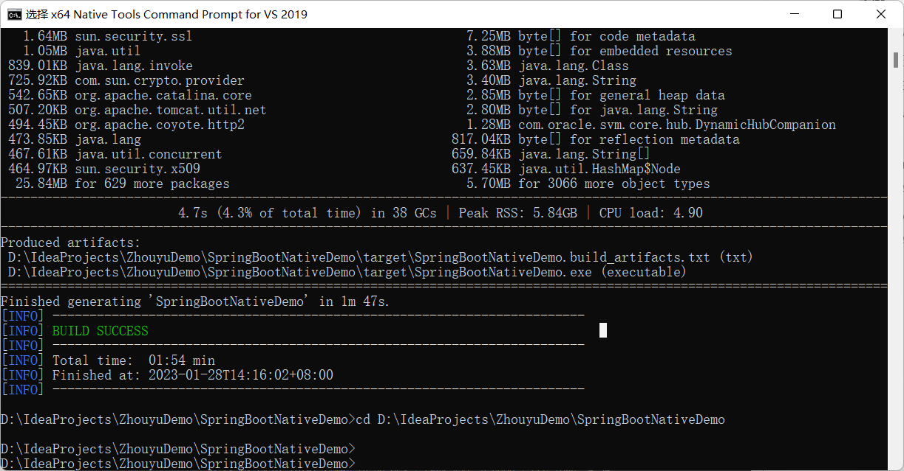

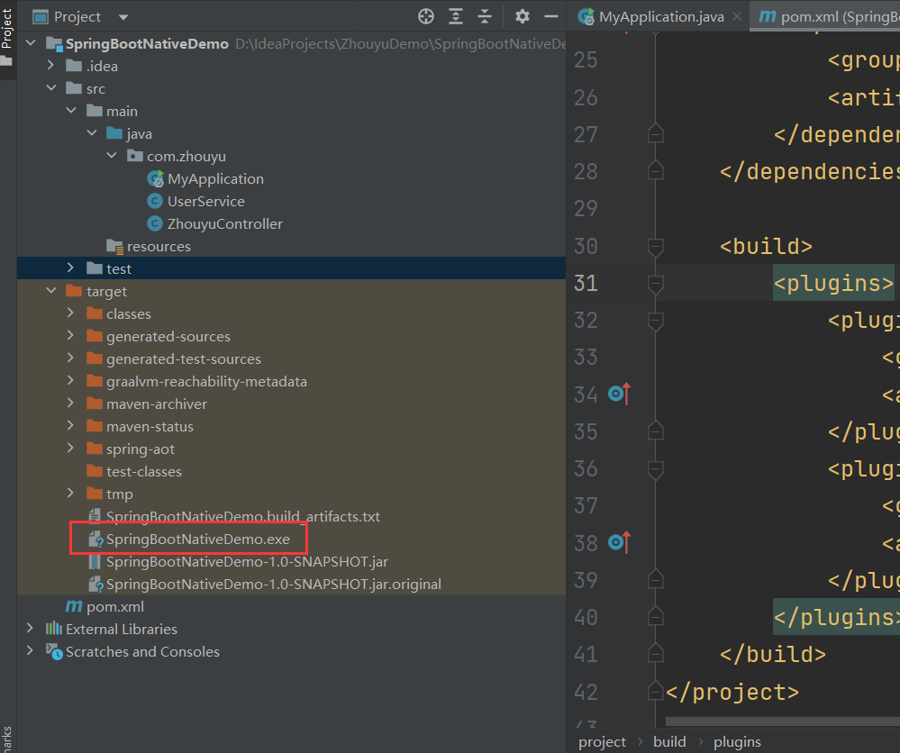


这样，我们就能够直接运行这个exe来启动我们的SpringBoot项目了。


## GraalVM的限制
GraalVM在编译成二进制可执行文件时，需要确定该应用到底用到了哪些类、哪些方法、哪些属性，从而把这些代码编译为机器指令（也就是exe文件）。但是我们一个应用中某些类可能是动态生成的，也就是应用运行后才生成的，为了解决这个问题，GraalVM提供了配置的方式，比如我们可以在编译时告诉GraalVM哪些方法会被反射调用，比如我们可以通过reflect-config.json来进行配置。


### 通过RuntimeHints解决
假如应用中有如下代码：

```java
/**
* 作者：徐庶
*/
public class XushuService {

    public String test(){
        return "xushu";
    }
}
```


```java
@Component
public class UserService {

    public String test(){

        String result = "";
        try {
            Method test = XushuService.class.getMethod("test", null);
            result = (String) test.invoke(XushuService.class.newInstance(), null);
        } catch (NoSuchMethodException e) {
            throw new RuntimeException(e);
        } catch (InvocationTargetException e) {
            throw new RuntimeException(e);
        } catch (IllegalAccessException e) {
            throw new RuntimeException(e);
        } catch (InstantiationException e) {
            throw new RuntimeException(e);
        }

        return result;
    }

}
```


在UserService中，通过反射的方式使用到了XushuService的无参构造方法（XushuService.class.newInstance()），如果我们不做任何处理，那么打成二进制可执行文件后是运行不了的，可执行文件中是没有XushuService的无参构造方法的，会报如下错误：

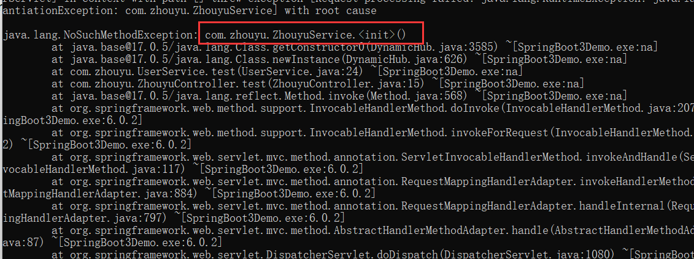


我们可以通过Spring提供的Runtime Hints机制来间接的配置reflect-config.json。


#### 方式一：RuntimeHintsRegistrar


提供一个RuntimeHintsRegistrar接口的实现类，并导入到Spring容器中就可以了：

```java
@Component
@ImportRuntimeHints(UserService.XushuServiceRuntimeHints.class)
public class UserService {

    public String test(){

        String result = "";
        try {
            Method test = XushuService.class.getMethod("test", null);
            result = (String) test.invoke(XushuService.class.newInstance(), null);
        } catch (NoSuchMethodException e) {
            throw new RuntimeException(e);
        } catch (InvocationTargetException e) {
            throw new RuntimeException(e);
        } catch (IllegalAccessException e) {
            throw new RuntimeException(e);
        } catch (InstantiationException e) {
            throw new RuntimeException(e);
        }


        return result;
    }

    static class XushuServiceRuntimeHints implements RuntimeHintsRegistrar {

        @Override
        public void registerHints(RuntimeHints hints, ClassLoader classLoader) {
            try {
                hints.reflection().registerConstructor(XushuService.class.getConstructor(), ExecutableMode.INVOKE);
            } catch (NoSuchMethodException e) {
                throw new RuntimeException(e);
            }
        }
    }
}
```


#### 方式二：@RegisterReflectionForBinding
```java
@RegisterReflectionForBinding(XushuService.class)
public String test(){

    String result = "";
    try {
        Method test = XushuService.class.getMethod("test", null);
        result = (String) test.invoke(XushuService.class.newInstance(), null);
    } catch (NoSuchMethodException e) {
        throw new RuntimeException(e);
    } catch (InvocationTargetException e) {
        throw new RuntimeException(e);
    } catch (IllegalAccessException e) {
        throw new RuntimeException(e);
    } catch (InstantiationException e) {
        throw new RuntimeException(e);
    }


    return result;
}
```


**注意**

如果代码中的methodName是通过参数获取的，那么GraalVM在编译时就不能知道到底会使用到哪个方法，那么test方法也要利用RuntimeHints来进行配置。


```java
@Component
@ImportRuntimeHints(UserService.XushuServiceRuntimeHints.class)
public class UserService {

    public String test(){

        String methodName = System.getProperty("methodName");

        String result = "";
        try {
            Method test = XushuService.class.getMethod(methodName, null);
            result = (String) test.invoke(XushuService.class.newInstance(), null);
        } catch (NoSuchMethodException e) {
            throw new RuntimeException(e);
        } catch (InvocationTargetException e) {
            throw new RuntimeException(e);
        } catch (IllegalAccessException e) {
            throw new RuntimeException(e);
        } catch (InstantiationException e) {
            throw new RuntimeException(e);
        }


        return result;
    }

    static class XushuServiceRuntimeHints implements RuntimeHintsRegistrar {

        @Override
        public void registerHints(RuntimeHints hints, ClassLoader classLoader) {
            try {
                hints.reflection().registerConstructor(XushuService.class.getConstructor(), ExecutableMode.INVOKE);
                hints.reflection().registerMethod(XushuService.class.getMethod("test"), ExecutableMode.INVOKE);
            } catch (NoSuchMethodException e) {
                throw new RuntimeException(e);
            }
        }
    }
}
```


或者使用了JDK动态代理：

```java
public String test() throws ClassNotFoundException {

    String className = System.getProperty("className");
	Class<?> aClass = Class.forName(className);

	Object o = Proxy.newProxyInstance(UserService.class.getClassLoader(), new Class[]{aClass}, new InvocationHandler() {
    	@Override
    	public Object invoke(Object proxy, Method method, Object[] args) throws Throwable {
        	return method.getName();
    	}
	});

	return o.toString();
}
```

那么也可以利用RuntimeHints来进行配置要代理的接口：

```java
public void registerHints(RuntimeHints hints, ClassLoader classLoader) {
    hints.proxies().registerJdkProxy(UserInterface.class);
}
```


#### 方式三：@Reflective
对于反射用到的地方，我们可以直接加一个@Reflective，前提是XushuService得是一个Bean：

```java
@Component
public class XushuService {

    @Reflective
    public XushuService() {
    }

    @Reflective
    public String test(){
        return "Xushu";
    }
}
```


以上Spring6提供的RuntimeHints机制，我们可以使用该机制更方便的告诉GraalVM我们额外用到了哪些类、接口、方法等信息，最终Spring会生成对应的reflect-config.json、proxy-config.json中的内容，GraalVM就知道了。


## Docker SpringBoot3.0 实战
我们可以直接把SpringBoot应用对应的本地可执行文件构建为一个Docker镜像，这样就能跨操作系统运行了。


> Buildpacks，类似<font style="color:rgb(18, 18, 18);">Dockerfile的镜像构建技术</font>
>

> 注意要安装docker，并启动docker
>

> 注意这种方式并不要求你机器上安装了GraalVM，会由SpringBoot插件利用/paketo-buildpacks/native-image来生成本地可执行文件，然后打入到容器中
>


Docker镜像名字中不能有大写字母，我们可以配置镜像的名字：

```xml
<properties>
  <maven.compiler.source>17</maven.compiler.source>
  <maven.compiler.target>17</maven.compiler.target>
  <project.build.sourceEncoding>UTF-8</project.build.sourceEncoding>
  <spring-boot.build-image.imageName>springboot3demo</spring-boot.build-image.imageName>
</properties>
```


然后执行：

```xml
mvn -Pnative spring-boot:build-image
```

来生成Docker镜像，成功截图：

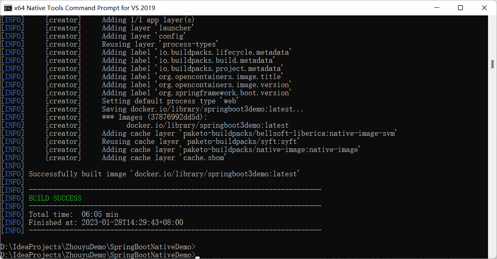


执行完之后，就能看到docker镜像了：

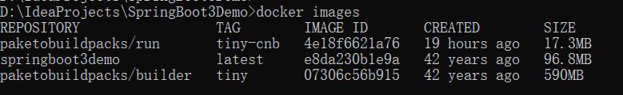


然后就可以运行容器了：

```xml
docker run --rm -p 8080:8080 springboot3demo
```


如果要传参数，可以通过-e

```java
docker run --rm -p 8080:8080 -e methodName=test springboot3demo
```

不过代码中，得通过以下代码获取：

```java
String methodName = System.getenv("methodName")
```


建议工作中直接使用Environment来获取参数：

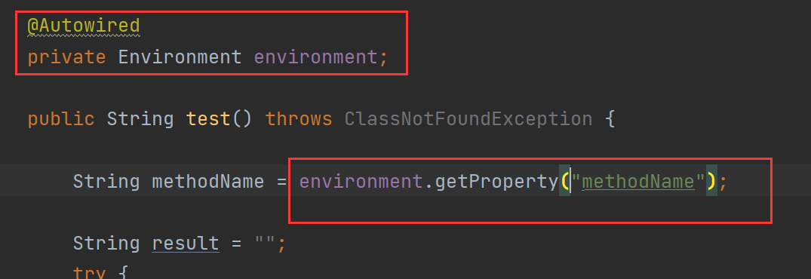


> 更新: 2024-12-23 16:37:13  
> 原文: <https://www.yuque.com/tulingzhouyu/sfx8p0/kyo9smam2fqvnryc>